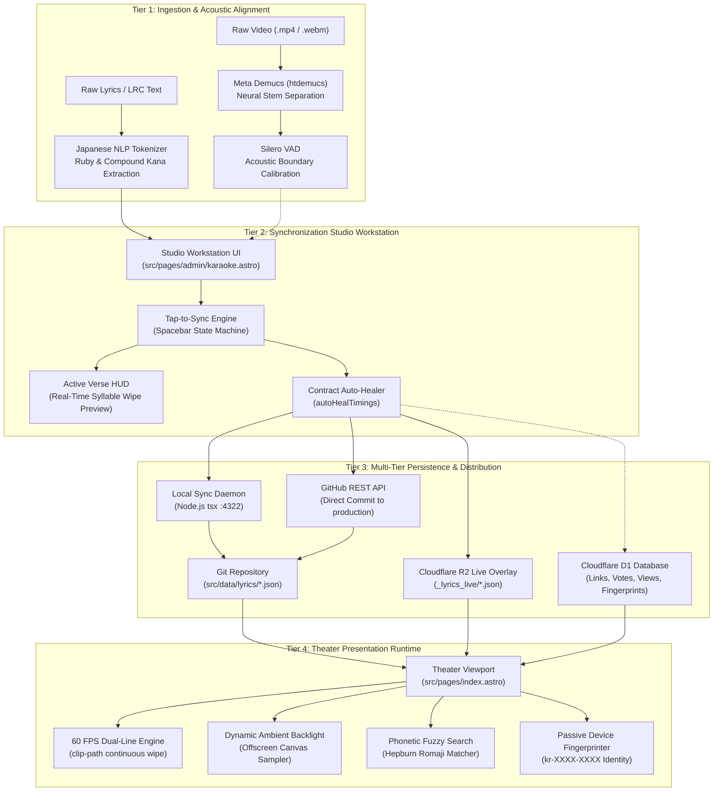
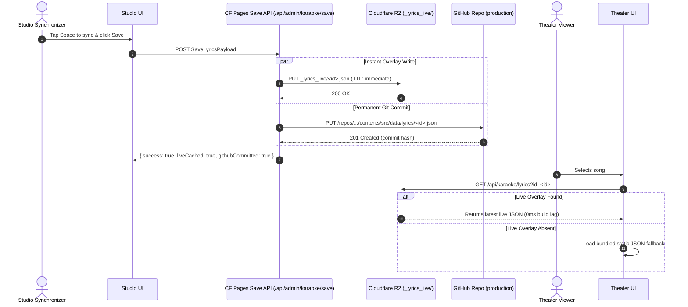

# 01. System Architecture & End-to-End Data Flow

> A structural analysis of the Karaoke Theater architecture, detailing component boundaries, end-to-end data lifecycle, edge infrastructure, and foundational design principles.

---

## 🏛️ Architectural Topology

Karaoke Theater is structured as a **four-tier pipeline** designed to balance real-time browser performance, authoring precision, and distributed edge delivery without requiring a monolithic application server.

---

## 🔄 End-to-End Lifecycle of a Track

Understanding how a track transitions from an unedited video file to a synchronized, playable theater experience is fundamental to the system's architecture.

### 1. Ingestion Phase
- **Media Ingestion**: A video file (`Artist - Title.mp4`) is selected by an administrator in the Synchronization Studio or uploaded directly via the Studio Upload Modal (`/api/admin/karaoke/upload`). The upload is streamed directly into the Cloudflare R2 bucket (`MEDIA_BUCKET`) under a sanitized canonical filename.
- **Lyrics Ingestion**: Raw lyrics text or synchronized LRC text is pasted into the Ingestion Modal. The core tokenizer parses the text into structured `Verse` and `Word` objects, automatically extracting Yomitan bracket syntax (e.g. `漢字[かんじ]`), detecting compound kana, and preserving Latin word boundaries.
- **Punctuation Attachment**: Isolated quotation marks, brackets, and full stops are automatically merged into their phonetically adjacent words via `cleanVersePunctuation`, preventing empty or awkward tap targets during synchronization.

### 2. Synchronization Phase
- **Audio/Video Playback**: The track is loaded into the Studio's HTML5 video element directly from the high-throughput R2 CDN (`https://cdn.sudothy.me`).
- **Tap-to-Sync Execution**: The user focuses the interactive timing matrix and taps <kbd>SPACE</kbd> along with the vocal performance. The synchronization state machine assigns the current video timecode to the active word, seals the end time of the preceding word, auto-advances through the verse, and automatically advances verses upon completion.
- **Micro-Adjustments**: The user can scrub with `J` / `K` / `L`, nudge word timestamps in +/-50ms increments using `[` and `]`, modify the playback rate (0.5x, 0.75x, 1.0x, 1.25x), or set a song-wide global offset.

### 3. Verification & Persistence Phase
- **Auto-Healing**: Prior to writing, `autoHealTimings` evaluates the verses. If the final word of a phrase has an unclosed endpoint, the auto-healer calculates the average syllable duration of the verse and computes a natural vocal hold (bounded between 0.8s and 1.8s) so the highlight holds musically rather than truncating abruptly.
- **Multi-Tier Persistence Route**:
  1. **Tier 1 (Local Git Daemon)**: If running locally (`npm run sync:server`), a `POST` request to `http://localhost:4322/save` writes the lyric file directly to `src/data/lyrics/<id>.json` and updates `src/data/songs-manifest.json` with deterministic phonetic sorting.
  2. **Tier 2 (Cloudflare Edge Save)**: If running in production, a `POST` request to `/api/admin/karaoke/save` immediately uploads the payload to R2 under `_lyrics_live/<id>.json` (ensuring 0-second latency for live theater playback) and dispatches an authenticated commit to GitHub via the GitHub REST API.
  3. **Tier 3 (Offline Export)**: If both endpoints are unreachable, the Studio opens the JSON Export Drawer, allowing the user to copy or download the validated payload with zero data loss.

### 4. Theater Presentation Phase
- **Catalog Union**: When a user opens the Karaoke Theater (`/`), `loadCatalog()` merges the static Git manifest with live videos and live overlays discovered in R2.
- **Lazy Lyric Loading**: When a track is selected, `loadLyrics(id)` checks for an active R2 live overlay first (`/api/karaoke/lyrics?id=<id>`). If none exists, it instantly falls back to the Vite-bundled static JSON module.
- **60 FPS Execution**: The presentation engine takes control, calculating frame-by-frame syllable wipe percentages, orchestrating alternating dual-line staging, and projecting ambient dynamic backlighting.

---

## 🏗️ Core Architectural Design Decisions

### 1. Separation of Media Blobs from Metadata
- **Problem**: Storing video files (`.mp4`, `.webm`) inside a Git repository quickly bloats repository size, degrades `git clone` performance, and violates GitHub file size limits.
- **Solution**: Complete separation of concerns:
  - **Media Blobs**: Hosted exclusively on Cloudflare R2 (`gewoonthy-media`) and fronted by custom domain CDN `https://cdn.sudothy.me`.
  - **Timing & Text Metadata**: Maintained as clean, version-controlled JSON files (`src/data/lyrics/*.json`) in Git, keeping the repository lightweight (< 5 MB excluding audio stems).
  - **Dynamic State**: Voting, view counts, shortlinks, and anonymous identity fingerprints are stored in Cloudflare D1 serverless SQLite (`system_data`).

### 2. Zero-Delay Live Overlays (`_lyrics_live/`)
- **Problem**: Modern static site generation (SSG) with Astro requires a build and deployment step whenever files in `src/data/` change. In production, waiting 2–5 minutes for a CI/CD build to verify freshly synchronized lyrics is unacceptable.
- **Solution**: The live overlay architecture:
  - When saving via the Cloudflare Pages API, the payload is immediately written to R2 under `_lyrics_live/<id>.json`.
  - The theater player's `loadLyrics` function requests `/api/karaoke/lyrics?id=<id>` before falling back to bundled static JSON.
  - As a result, the freshly synced lyrics are **instantly playable in production within 50 milliseconds** of clicking Save, while the permanent GitHub commit builds asynchronously in the background.

### 3. Client-Side Copy & DevTools Protection
To safeguard proprietary lyric synchronizations and maintain theater immersion:
- **Global Context Menu Disabled**: Right-clicking is intercepted and suppressed via `contextmenu` event listeners.
- **Selection & Dragging Disabled**: `user-select: none !important;` is enforced globally via CSS alongside `selectstart` and `dragstart` JavaScript preventions.
- **Inspection Hotkeys Blocked**: Keystrokes for DevTools (`F12`, `Ctrl+Shift+I`, `Ctrl+Shift+J`, `Ctrl+Shift+C`, `Ctrl+U`, `Ctrl+S`) are blocked at the window level.
- **Clipboard Interception**: The `copy` event is intercepted at the capture phase; clipboard writes are blocked unless initiated through the authorized track share button.
- **Crawler & Bot Rejection**: Cloudflare Pages middleware (`functions/_middleware.js`) detects known scraper user agents (Discordbot, Twitterbot, TelegramBot, WhatsApp, Googlebot, etc.) and terminates the connection with an empty `200 OK` text response and `X-Robots-Tag: noindex, nofollow, nosnippet`, ensuring external platforms generate zero rich link cards or snippet previews.

### 4. Warm Near-Black & Brass Design Philosophy
The UI rejects generic modern web aesthetics—specifically bright neon glows, heavy glassmorphism blur filters, and generic AI blue-slate color schemes:
- **Palette**: Deep near-black background (`#131211`), warm surface tones (`#1d1b16`, `#24211b`), and classic metallic brass accents (`#deb668`).
- **Visual Stability**: The lyrics stage is constrained to an invariant height (128px) with zero layout shifting or viewport resizing.
- **Typography**: Paired display fonts (`Plus Jakarta Sans` for UI, `JetBrains Mono` for timecodes and metrics, and `Zen Kurenaido` / `Noto Sans JP` for CJK glyphs) tuned for instantaneous reading under high-speed syllable wiping.
