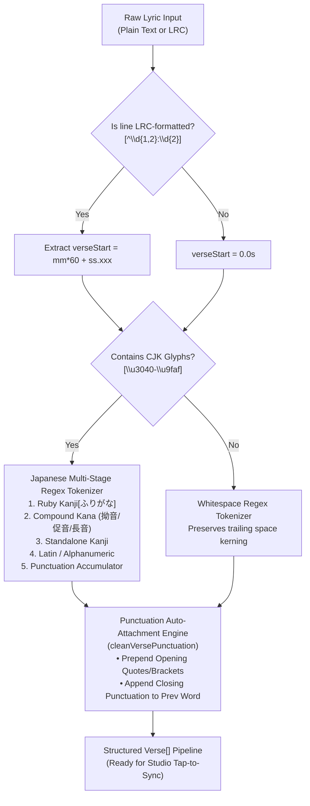

# 03. Tokenizer, NLP Pipeline & Punctuation Auto-Attachment

> A deep dive into multilingual lyric parsing, Japanese ruby extraction, compound kana preservation, automated punctuation merging, and deterministic slugification.

---

## 🌐 Linguistic Ingestion Architecture

Lyric ingestion in Karaoke Theater handles diverse typographic systems:
- **Latin & Cyrillic**: Whitespace-delimited words requiring trailing space preservation to prevent unnatural kerning.
- **Japanese (CJK)**: Continuous script without word boundaries containing Kanji, Hiragana, Katakana, and ruby (Furigana) annotations.
- **Standardized LRC Timestamps**: Pre-synchronized lines formatted as `[mm:ss.xxx]`.



---

## 🎌 Japanese Multi-Stage NLP Tokenizer

In [`src/core/tokenizer.ts`](file:///home/thy/Projects/%E3%82%AB%E3%83%A9%E3%82%AA%E3%82%B1/src/core/tokenizer.ts), the `parseRawLyrics()` function employs a specialized regular expression tokenizer designed for Japanese lyric prosody:

```typescript
const tokenRegex = 
  /([\u4e00-\u9faf\u3400-\u4dbf]+)\[([\u3040-\u309f\u30a0-\u30ff]+)\]|([\u3040-\u309f\u30a0-\u30ff][ぁぃぅぇぉっゃゅょゎァィゥェォッャュョヮー]*)|([\u4e00-\u9faf\u3400-\u4dbf])|([^\s\u3000-\u303f\u3040-\u309f\u30a0-\u30ff\uff00-\uff9f\u4e00-\u9faf\u3400-\u4dbf「『“‘"'(（【〔《〈［\[」』”’"')）】〕》〉］\]、。！？!?…・―—~〜,.:;]+)|([「『“‘"'(（【〔《〈［\[」』”’"')）】〕》〉］\]、。！？!?…・―—~〜,.:;]+)|(\s+)/gu;
```

### Match Groups & Processing Precedence

1. **Ruby Annotations (`漢字[かんじ]`)**:
   Matches Kanji sequences followed immediately by bracketed readings.
   - *Example*: `奇跡[きせき]` becomes `{ word: "奇跡", furigana: "きせき" }`.
   - Preserves semantic Kanji groupings while capturing phonetic Kana for rendering over the glyph.
2. **Compound Kana (拗音 Yōon, 促音 Sokuon, 長音 Chōonpu)**:
   Matches standard Hiragana or Katakana followed by small modifiers (`ぁぃぅぇぉっゃゅょゎ`) or prolonged sound marks (`ー`).
   - *Example*: `きょ` (kya/kyo) or `ちょっと` or `パーティー`.
   - Prevents small kana from splitting into independent word chips, maintaining exact natural singing syllables.
3. **Standalone Kanji**:
   Matches unannotated individual Kanji glyphs (`[\u4e00-\u9faf]`) for per-morpheme tap synchronization.
4. **Latin / Alphanumeric Words**:
   Captures mixed-in English or romaji words seamlessly without fragmenting letters.
5. **Punctuation Sequences**:
   Captures full-width and half-width quotation marks, brackets, commas, and ideographic periods.
6. **Whitespace**:
   Maintains spacing boundaries between non-CJK words without introducing artifacts into continuous Japanese text.

---

## 🪝 Punctuation Auto-Attachment Engine

### The Problem with Traditional Subtitling
In typical lyric timing tools, punctuation marks such as `"` or `(` or `!` are treated as independent tokens. During a high-speed live karaoke performance:
- A user must awkwardly tap the spacebar for a quotation mark before the first vocal sound occurs.
- Tapping a question mark at the end of a sentence creates an unnatural extra syllable.

### The Solution: Punctuation Merging
[`src/core/punctuation.ts`](file:///home/thy/Projects/%E3%82%AB%E3%83%A9%E3%82%AA%E3%82%B1/src/core/punctuation.ts) implements an automated accumulator state machine (`cleanVersePunctuation`) that eliminates standalone punctuation:

```typescript
export const OPENING_PUNCT_REGEX = /^[「『“‘"'(（【〔《〈［\[]+$/;
export const CLOSING_PUNCT_REGEX = /^[」』”’"')）】〕》〉］\]、。！？!?…・―—~〜,.:;]+$/;
export const ALL_PUNCT_REGEX     = /^[「『“‘"'(（【〔《〈［\[」』”’"')）】〕》〉］\]、。！？!?…・―—~〜,.:;\s]+$/;
```



```mermaid
stateDiagram-v2
    [*] --> ReadNextToken
    ReadNextToken --> IsPunctuation: Token checked against ALL_PUNCT_REGEX
    ReadNextToken --> IsPhoneticWord: Token is normal word

    IsPunctuation --> OpeningPunct: Matches OPENING_PUNCT_REGEX
    OpeningPunct --> AccumulatePrefix: pendingPrefix += punct
    AccumulatePrefix --> ReadNextToken

    IsPunctuation --> ClosingPunct: Matches CLOSING_PUNCT_REGEX
    ClosingPunct --> AttachToPrev: prevWord.word += punct; extend prevWord.end
    AttachToPrev --> ReadNextToken

    IsPhoneticWord --> PrependPending: word.word = pendingPrefix + word.word
    PrependPending --> ClearPrefix: pendingPrefix = ""
    ClearPrefix --> AppendToCleaned: cleaned.push(word)
    AppendToCleaned --> ReadNextToken
```

### Execution Rules
- **Opening Punctuation**: Pushed into a buffer (`pendingPrefix`) and prepended to the *subsequent* phonetic word.
  - *Input*: `[ "“", "Hello" ]` $\rightarrow$ *Output*: `[ "“Hello" ]`.
- **Closing Punctuation**: Appended immediately to the *previous* phonetic word.
  - *Input*: `[ "World", "!”" ]` $\rightarrow$ *Output*: `[ "World!”" ]`.
- **Orphan Edge Cases**: If a line begins or ends with unmatched punctuation, it safely merges into the nearest available word.

---

## 🏷️ Canonical Normalization & Slugs

Deterministic URL routing and storage keys require standardizing text input across operating systems, Unicode normalization formats, and international scripts.

### 1. Unicode NFC Standardisation
Input text is normalized to Unicode NFC (`str.normalize('NFC').trim()`) to prevent dual-byte composition discrepancies between macOS (which defaults to NFD) and Linux/Windows (which default to NFC).

### 2. Video Filename Canonicalization
```typescript
export function canonicalVideoFilename(artist: string, title: string, ext = 'mp4'): string {
  const cleanArtist = normalizeText(artist).replace(/[\/\\:*?"<>|]/g, '').trim() || 'Unknown';
  const cleanTitle = normalizeText(title).replace(/[\/\\:*?"<>|]/g, '').trim() || 'Untitled';
  const cleanExt = ext.replace(/^\./, '').toLowerCase() || 'mp4';
  return `${cleanArtist} - ${cleanTitle}.${cleanExt}`;
}
```
All filesystem and URI reserved characters (`/ \ : * ? " < > |`) are stripped, ensuring safe object keys in Cloudflare R2 and clean cross-platform local disk operations.

### 3. Canonical Song ID Slugs
`canonicalSongId(artist, title, explicitSlug)` ([`src/core/tokenizer.ts`](file:///home/thy/Projects/%E3%82%AB%E3%83%A9%E3%82%AA%E3%82%B1/src/core/tokenizer.ts)) generates URL-safe identifiers:
1. **Accented Character Decomposition**: Uses Unicode NFD to decompose characters (e.g. `É` $\rightarrow$ `E` + `\u0301`, `ø` $\rightarrow$ `o`) and strips the combining diacritical marks (`/[\u0300-\u036f]/g`).
2. **Hyphenation**: Replaces non-alphanumeric characters with `-` and trims leading/trailing dashes.
   - *Example*: `Racionais MC's` + `A Vida É Desafio` $\rightarrow$ `a-vida-e-desafio`.
   - *Example*: `Yamê` + `Bécane` $\rightarrow$ `yame-becane`.
3. **Non-Latin Fallback Handling**: If stripping Latin diacritics leaves an empty string (e.g., pure Japanese Kanji or Cyrillic), a Unicode-aware regex (`/[\s\p{P}\p{S}]+/gu`) cleans the string without destroying the native characters:
   - *Example*: `きゃりーぱみゅぱみゅ` + `もんだいガール` $\rightarrow$ `きゃりーぱみゅぱみゅ-もんだいガール`.
