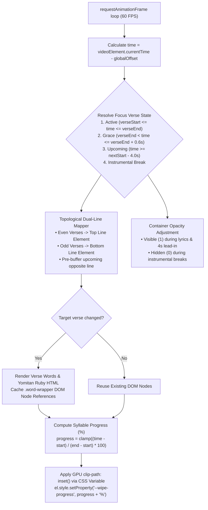

# 04. 60 FPS Presentation Render Engine & Theater Experience

> Comprehensive architectural breakdown of the 60 FPS presentation engine, the 4-second lead-in rule, alternating dual-line staging, GPU-accelerated syllable wiping, and Yomitan ruby rendering.

---

## ⚡ 60 FPS Render Engine Architecture

The presentation engine ([`src/renderer/renderEngine.ts`](file:///home/thy/Projects/%E3%82%AB%E3%83%A9%E3%82%AA%E3%82%B1/src/renderer/renderEngine.ts)) coordinates visual synchronization with audio/video playback at 60 frames per second. It uses a high-performance `requestAnimationFrame` loop completely decoupled from heavy framework component lifecycles.



---

## ⏱️ The 4-Second Lead-In Rule & Temporal Windowing

A common failure mode in karaoke software is displaying lyrics statically during long instrumental intros or multi-minute guitar solos, cluttering the screen and disorienting the singer.

Karaoke Theater enforces a strict **temporal windowing model**:

```typescript
const LEAD_IN_SECONDS = 4.0; // Lyrics strictly appear 4.0s before vocal onset
const FADE_OUT_GRACE  = 0.6; // Brief grace period after verse ends before clearing
```

### Temporal States

1. **Active Vocal State** ($t_{\text{start}} \le t \le t_{\text{end}}$):
   The verse is actively singing. The active line is marked `.k-line-active` with full opacity and magnified typography; word highlighting progressively fills syllables based on timestamps.
2. **Fade-Out Grace Period** ($t_{\text{end}} < t \le t_{\text{end}} + 0.6\text{s}$):
   Prevents immediate, jarring disappearance of lines upon finishing the last word. All words maintain 100% completed highlight.
3. **Pre-Buffering Lead-In Window** ($t_{\text{next}} - 4.0\text{s} \le t < t_{\text{next}}$):
   Lyrics mount smoothly onto the stage exactly 4.0 seconds prior to vocal onset, displaying in an idle state (`.k-line-idle`) so the performer can prepare their breathing and phrasing.
4. **Instrumental Break State**:
   If the gap between verses exceeds 4.0 seconds, `focusV` evaluates to `-1`. The stage container transitions to `opacity: 0`. The entire viewport clears, returning focus purely to the video.

---

## 🎭 Topological Alternating Dual-Line Staging

To eliminate chaotic scrolling and sudden viewport refits, the stage utilizes a **topological alternating dual-line system**:
- **Even Verses** ($0, 2, 4, \dots$) $\rightarrow$ Rendered on the **Top Line** element.
- **Odd Verses** ($1, 3, 5, \dots$) $\rightarrow$ Rendered on the **Bottom Line** element.

```
┌─────────────────────────────────────────────────────────────┐
│                      THEATER VIEWPORT                       │
├─────────────────────────────────────────────────────────────┤
│  [TOP LINE - Even Verse]                                    │
│  Even verse currently singing: "Плак- плак, плак- плак..."  │
│                                                             │
│  [BOTTOM LINE - Odd Verse]                                  │
│  Next odd verse pre-buffered: "Я тебе писала и ждала..."    │
└─────────────────────────────────────────────────────────────┘
```

### Dynamic Pre-Buffering
- When an **Even** verse is active on the Top line, the **Bottom line automatically pre-buffers the next Odd verse**.
- When an **Odd** verse is active on the Bottom line, the **Top line automatically pre-buffers the next Even verse**.
- When transitioning lines, only the newly upcoming line's DOM is re-rendered; the active singing line remains untouched in GPU memory, guaranteeing zero dropped frames or text flickering.

---

## 🎨 GPU-Accelerated Continuous Syllable Wipe

Traditional lyric renderers rely on stepped color switches, character-by-character reveals, or CPU canvas redrawing. Karaoke Theater uses **hardware-accelerated CSS `clip-path` continuous wiping**.

### DOM Structure per Word
```html
<span class="word-wrapper" id="w-top-0">
  <span class="word-base">Syllable</span>
  <span class="word-highlight" aria-hidden="true">Syllable</span>
</span>
```

### CSS Syllable Wipe Engine ([`src/styles/theater.css`](file:///home/thy/Projects/%E3%82%AB%E3%83%A9%E3%82%AA%E3%82%B1/src/styles/theater.css))
```css
.word-wrapper {
  position: relative;
  display: inline-block;
  vertical-align: baseline;
}

.word-base {
  color: inherit;
  user-select: none;
}

.word-highlight {
  position: absolute;
  top: 0;
  left: 0;
  width: 100%;
  height: 100%;
  color: var(--accent-brass); /* #deb668 */
  pointer-events: none;
  user-select: none;
  clip-path: inset(-30px calc(100% - var(--wipe-progress, 0%)) -15px 0);
  will-change: clip-path;
}
```

### Frame Calculation
For each word in the active verse, the engine computes:

$$\text{Progress} = \min\left(100, \max\left(0, \frac{t_{\text{current}} - w.\text{start}}{w.\text{end} - w.\text{start}} \times 100\right)\right)$$

This value is passed directly to the element via CSS custom property `--wipe-progress`:
```typescript
el.style.setProperty('--wipe-progress', `${progress}%`);
```
The GPU renders the geometric wipe boundary using sub-pixel interpolation with zero DOM layout recalculations (`reflow`).

---

## 🏮 Yomitan Ruby (Furigana) Synchronized Wiping

Japanese lyrics frequently require Furigana (reading annotations) above Kanji. Traditional web implementations use HTML `<ruby>` / `<rt>` tags, which break cross-browser baseline alignment and cannot be cleanly clipped alongside the parent text.

### The Pseudo-Element Ruby Architecture
The tokenizer wraps annotated words as:
```html
<span class="yomitan-ruby" data-furi="きせき">奇跡</span>
```

### CSS Definition
```css
.yomitan-ruby {
  position: relative;
  display: inline-block;
}

.yomitan-ruby::before {
  content: attr(data-furi);
  position: absolute;
  bottom: calc(100% + 2px);
  left: 50%;
  transform: translateX(-50%);
  font-size: 0.48em;
  line-height: 1;
  font-weight: 600;
  white-space: nowrap;
  pointer-events: none;
  user-select: none;
  color: inherit;
  opacity: 0.9;
}
```

### Dual-Layer Wiping
Because `.word-highlight` clones the exact inner HTML—including the `.yomitan-ruby` element and its `data-furi` attribute—the parent `clip-path: inset(...)` (expanded vertically by `-30px` top and `-15px` bottom) **slices through both the Kanji glyph and its furigana annotation simultaneously in perfect unison**.

---

## 💡 Ambient Dynamic Backlight

To enhance visual immersion during playback, [`src/renderer/backlight.ts`](file:///home/thy/Projects/%E3%82%AB%E3%83%A9%E3%82%AA%E3%82%B1/src/renderer/backlight.ts) projects an ambient glow behind the video frame based on its real-time color palette:

1. **Offscreen Downsampling**: An off-screen HTML5 `<canvas>` (64×64 pixels) is initialized with `{ willReadFrequently: true }`.
2. **Throttled Sampling**: The sampler runs every other frame (30 FPS) to minimize GPU/CPU bus overhead.
3. **Color Averaging**: Pixel data is sampled at 16-pixel strides across the canvas:
   $$\overline{R} = \frac{1}{M}\sum R_i, \quad \overline{G} = \frac{1}{M}\sum G_i, \quad \overline{B} = \frac{1}{M}\sum B_i$$
4. **Dual-Layer Projection**: Colors are assigned to two layered background `<div>` elements with Gaussian blurs of `35px` and `60px` with smooth CSS transitions (`transition: background 0.35s ease`), creating a responsive stage lighting effect.

---

## 🎮 Theater Controls & Keybindings

The Theater frontend ([`src/player/karaokePlayer.ts`](file:///home/thy/Projects/%E3%82%AB%E3%83%A9%E3%82%AA%E3%82%B1/src/player/karaokePlayer.ts)) provides transport controls and hotkeys:

| Keybinding | Function | Description |
| :--- | :--- | :--- |
| <kbd>SPACE</kbd> or <kbd>K</kbd> | Play / Pause | Toggles video playback. |
| <kbd>J</kbd> | Rewind | Seeks backward 2.0 seconds. |
| <kbd>L</kbd> | Fast Forward | Seeks forward 2.0 seconds. |
| <kbd>M</kbd> | Mute / Unmute | Toggles audio mute state. |
| <kbd>F</kbd> | Fullscreen | Enters/exits browser fullscreen mode on the theater stage. |
| <kbd>/</kbd> | Focus Search | Focuses and highlights the fuzzy search pill. |
| <kbd>ESC</kbd> | Defocus Search | Clears focus from search pill to resume hotkeys. |
