# 05. Synchronization Studio Workstation & Tap-to-Sync Engine

> Comprehensive design of the 3-column studio workstation, keyboard-first tap-to-sync state machine, real-time telemetry, visual timeline scrubbing, and multimodal ingestion drawers.

---

## 🎛️ Studio Architecture & Workspace Layout

The Synchronization Studio ([`src/pages/admin/karaoke.astro`](file:///home/thy/Projects/%E3%82%AB%E3%83%A9%E3%82%AA%E3%82%B1/src/pages/admin/karaoke.astro)) is a professional authoring workstation designed for high-efficiency audio-lyric synchronization.

```
┌────────────────────────────────────────────────────────────────────────────────────────┐
│ TOP BAR: [Brand] [Inspector Toggle] [+ Upload] [Track Filter & Dropdown] [Timecode HUD] [Save]│
├───────────────────┬───────────────────────────────────────────────┬────────────────────┤
│ LEFT PANEL:       │ CENTER PANEL:                                 │ RIGHT PANEL:       │
│ Track Inspector   │ Video Monitor & Scrubber Deck                 │ Interactive Timing │
│                   │                                               │ Matrix             │
│ • Artwork Preview │ • HTML5 Video Element                         │                    │
│ • iTunes Match    │ • Live Active Verse HUD (Real-Time Wipe)      │ • Verse Cards      │
│ • Progress Bar    │ • Scrubber Track with Verse Timeline Blocks   │ • Word Chips       │
│ • Telemetry Stats │ • Transport Controls (Play, +/-2s seek)       │ • Word Timestamps  │
│ • Metadata Form   │ • Playback Rate Selectors (0.5x, 0.75x, etc.) │ • Translation Rows │
│ • Dialect Toggles │ • Global Offset Micro-Steppers                │ • Ingest / Add     │
└───────────────────┴───────────────────────────────────────────────┴────────────────────┘
```

The workstation is implemented across modular TypeScript modules in [`src/studio/`](file:///home/thy/Projects/%E3%82%AB%E3%83%A9%E3%82%AA%E3%82%B1/src/studio/):
- `dom.ts`: Cached, strongly-typed element references.
- `state.ts`: Central mutable state container (`catalog`, `activeSong`, `localLyrics`, `currentV`, `currentW`, `globalOffset`).
- `syncEngine.ts`: Spacebar event handling and keyboard modifier dispatch.
- `renderer.ts`: Dynamic rendering of matrix cards, chips, and telemetry.
- `player.ts`: Video playback synchronization and live verse HUD.
- `persistence.ts`: Multi-tier save pipeline orchestration.
- `modals.ts`: Upload, ingestion, shortcuts, and JSON export dialog controllers.

---

## ⌨️ Keyboard-First Tap-to-Sync State Machine

The core synchronization engine ([`src/studio/syncEngine.ts`](file:///home/thy/Projects/%E3%82%AB%E3%83%A9%E3%82%AA%E3%82%B1/src/studio/syncEngine.ts)) turns lyric synchronization into an intuitive, rhythm-game-like experience. Focusing the right panel (`#matrix-pane`, `tabindex="0"`) captures keystrokes without interfering with standard browser hotkeys.

```mermaid
stateDiagram-v2
    [*] --> Idle: Focus Right Matrix Pane
    Idle --> TapSpace: Press SPACEBAR
    
    state TapSpace {
        [*] --> GetCurrentTime: time = vid.currentTime - globalOffset
        GetCurrentTime --> StampWordStart: words[w].start = time
        
        StampWordStart --> CheckFirstWord: Is w == 0?
        CheckFirstWord --> SetVerseStart: verse.verseStart = time
        CheckFirstWord --> ClosePreviousWord: words[w-1].end = time
        SetVerseStart --> AdvanceWordIndex
        ClosePreviousWord --> AdvanceWordIndex
        
        AdvanceWordIndex --> CheckVerseEnd: w >= verse.words.length?
        CheckVerseEnd --> CalculateVocalHold: Compute average syllable duration
        CalculateVocalHold --> SealVerseEnd: verse.verseEnd = lastWord.end + 0.4s
        SealVerseEnd --> AdvanceVerseIndex: v++; w = 0
        CheckVerseEnd --> UpdateChipDOM: w < verse.words.length
        AdvanceVerseIndex --> SkipPunctuation: Skip tokens matching ALL_PUNCT_REGEX
        SkipPunctuation --> UpdateChipDOM
    }

    UpdateChipDOM --> SurgicalDOMUpdate: In-place chip.classList.add('timed')
    SurgicalDOMUpdate --> Idle
```



### Step-by-Step Execution Sequence

1. **Timestamp Acquisition**:
   Captures sub-millisecond video time offset by the song-wide global adjustment:
   ```typescript
   const time = parseFloat((vid.currentTime - state.globalOffset).toFixed(3));
   ```
2. **Word Start Stamping**:
   Assigns `start = time` to `words[currentW]`.
3. **Verse Start Initialization**:
   If `currentW === 0`, `verse.verseStart` is automatically set to `time`.
4. **Previous Word Endpoint Sealing**:
   - If `currentW > 0`, the immediately preceding word's endpoint is sealed:
     ```typescript
     verse.words[currentW - 1].end = Math.max(verse.words[currentW - 1].start, time);
     ```
   - If `currentW === 0` and `currentV > 0`, the engine checks the previous verse's final word. It safely clips the word if the current verse started sooner than estimated, but **never stretches words across instrumental breaks**.
5. **Verse Completion & Natural Vocal Hold**:
   When `currentW` reaches the end of the verse:
   - The engine averages inner word durations to compute a rhythmic hold:
     $$H_{\text{natural}} = \max(0.8\text{s}, \min(1.8\text{s}, \overline{D}_{\text{syllable}} \times 2.0))$$
   - The final word's end is sealed at `time + naturalHold`.
   - `verse.verseEnd` is sealed at `(lastWord.end || time) + 0.4s`.
   - `currentW` resets to `0`, and `currentV` advances to the next verse.
6. **Automatic Punctuation Bypassing**:
   The engine checks if the next token is pure punctuation (`ALL_PUNCT_REGEX`). If so, it automatically increments indices, ensuring the user only ever taps phonetic vocal sounds.
7. **Surgical DOM Updates**:
   To prevent layout thrashing and maintain 60 FPS video playback during continuous tapping:
   - If advancing within the same verse, the engine mutates only the relevant DOM chips (`chip.classList.add('timed')` and shifts `.target-next`).
   - Only when transitioning across verse boundaries does `renderMatrix()` re-render the full container.

---

## 🕹️ Complete Studio Keybinding Reference

| Keybinding | Scope | Operation |
| :--- | :--- | :--- |
| <kbd>SPACE</kbd> | Timing Matrix | **Tap-to-Sync**: Stamps active word timestamp and advances target index. |
| <kbd>BACKSPACE</kbd> | Timing Matrix | **Undo Word**: Clears start and end timestamps of current word; moves index back. |
| <kbd>SHIFT</kbd> + <kbd>BACKSPACE</kbd> | Timing Matrix | **Delete Verse**: Permanently removes current verse from array. |
| <kbd>TAB</kbd> | Timing Matrix | **Focus Next**: Advances target word index without modifying timing. |
| <kbd>SHIFT</kbd> + <kbd>TAB</kbd> | Timing Matrix | **Focus Previous**: Rewinds target word index without modifying timing. |
| <kbd>[</kbd> / <kbd>]</kbd> | Timing Matrix | **Nudge Timing**: Adjusts active word timestamp by -50ms or +50ms. |
| <kbd>K</kbd> | Global | **Play / Pause**: Toggles video monitor playback. |
| <kbd>J</kbd> | Global | **Seek Backward**: Rewinds video by 2.0 seconds. |
| <kbd>L</kbd> | Global | **Seek Forward**: Advances video by 2.0 seconds. |
| <kbd>CTRL</kbd> + <kbd>S</kbd> / <kbd>CMD</kbd> + <kbd>S</kbd> | Global | **Save Master**: Validates contract and triggers multi-tier persistence pipeline. |
| <kbd>?</kbd> | Global | **Shortcuts Drawer**: Toggles keyboard shortcuts cheat sheet. |

---

## 📊 Telemetry Metrics & Visual Timeline Blocks

### Telemetry Bar
The left panel computes real-time synchronization progress:
$$\text{Progress \%} = \frac{\sum \text{Words with } start > 0}{\sum \text{Total Words}} \times 100$$
The progress bar (`#sync-progress-fill`) reflects completion state and turns green when 100% of words are timed.

### Timeline Verse Blocks
The scrubber track (`#timeline-track`) maps vocal activity geometrically along the horizontal axis ([`src/studio/player.ts`](file:///home/thy/Projects/%E3%82%AB%E3%83%A9%E3%82%AA%E3%82%B1/src/studio/player.ts)):
$$\text{Left \%} = \left(\frac{v.\text{verseStart}}{D_{\text{total}}}\right) \times 100, \quad \text{Width \%} = \left(\frac{v.\text{verseEnd} - v.\text{verseStart}}{D_{\text{total}}}\right) \times 100$$
This visual feedback allows the author to spot timing drift or overlapping verses instantly.

---

## 📥 Workstation Modals & Ingestion Drawers

### 1. Direct R2 Video Upload Modal
Allows authors to add new media without touching cloud consoles or command-line tools:
- Streams files directly to `/api/admin/karaoke/upload` via `multipart/form-data`.
- Auto-parses filenames (e.g. `"Racionais MC's - A Vida É Desafio.mp4"`) to extract artist and title.
- Sanitizes the input into canonical R2 keys (`canonicalVideoFilename`).
- Automatically creates a new catalog item in the Studio dropdown upon completion.

### 2. Raw Lyrics & LRC Ingestion Modal
- Accepts plain text lyrics or synced LRC documents.
- Automatically splits lines into verses.
- Runs Japanese NLP tokenization, extracting Yomitan bracket syntax (`漢字[かんじ]`).

### 3. Zero-Data-Loss JSON Export Modal
If both local daemons and cloud save handlers are offline, clicking **Export** opens an inspectable modal containing the complete, validated `SaveLyricsPayload`. Users can copy the JSON to clipboard or download it as `<id>.json` directly, guaranteeing that timing work is never lost.
