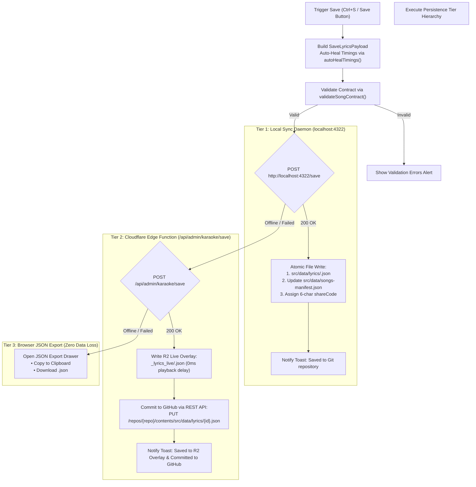
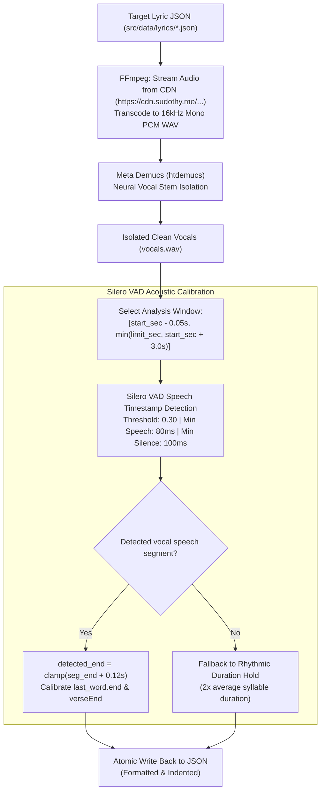

# 06. Multi-Tier Persistence & Acoustic Vocal Alignment Pipeline

> Technical analysis of the three-tier persistence architecture, local Node.js synchronization daemon, Cloudflare Pages live overlay caching, GitHub Git automation, and neural vocal separation with Demucs and Silero VAD.

---

## 💾 Multi-Tier Persistence Strategy

Timing synchronization is labor-intensive creative work. To prevent data loss across local development and production environments, the Studio Workstation employs a **three-tier fail-safe persistence pipeline** ([`src/studio/persistence.ts`](file:///home/thy/Projects/%E3%82%AB%E3%83%A9%E3%82%AA%E3%82%B1/src/studio/persistence.ts)).



---

## 🖥️ Tier 1: Local Synchronization Daemon

The local sync daemon ([`scripts/sync-server.ts`](file:///home/thy/Projects/%E3%82%AB%E3%83%A9%E3%82%AA%E3%82%B1/scripts/sync-server.ts)) is a lightweight Node.js HTTP server running on port `4322` via `npm run sync:server`.

### Responsibilities
1. **Mathematical Contract Enforcement**: Validates every incoming payload using `validateSongContract()`.
2. **Atomic Lyric File Persistence**: Formats and writes the individual lyric document to `src/data/lyrics/<id>.json`.
3. **Manifest Synchronization & Share Code Allocation**:
   - Reads `src/data/songs-manifest.json`.
   - If the song does not have an existing 6-character shortlink code, the daemon generates a unique collision-free code using a 62-character alphabet (`[A-Za-z0-9]`).
   - Updates or inserts the track metadata (`SongMetadata`).
   - Re-sorts the entire manifest deterministically using phonetic Romaji keys via `sortSongs()`.
   - Writes the updated manifest atomically.

---

## ☁️ Tier 2: Cloudflare Edge Function & GitHub Commit

When authors work directly in the deployed production environment, the local daemon is unreachable. The workstation routes requests to the Cloudflare Pages Function at [`functions/api/admin/karaoke/save.js`](file:///home/thy/Projects/%E3%82%AB%E3%83%A9%E3%82%AA%E3%82%B1/functions/api/admin/karaoke/save.js).

### Step 1: Instant R2 Live Overlay Write
```javascript
const liveKey = `_lyrics_live/${id}.json`;
await env.MEDIA_BUCKET.put(liveKey, JSON.stringify(payload, null, 2), {
  httpMetadata: { contentType: 'application/json' }
});
```
This write bypasses CI/CD deployment pipelines, making updated lyrics **immediately accessible to the Theater presentation runtime** at `/api/karaoke/lyrics?id=<id>`.

### Step 2: Automated Git Repository Commit
If `GITHUB_TOKEN` is configured in the Cloudflare Pages environment variables, the function commits the updated lyrics directly into the Git repository:
1. Queries the GitHub REST API for the current file SHA at `src/data/lyrics/${id}.json` on the target branch (default: `production`).
2. Dispatches a `PUT` request with base64-encoded content and commit message `sync(lyrics): update timings for ${id}`.
3. Permanent version history is captured without requiring local developer intervention.

---

## 🎙️ AI Acoustic Alignment Pipeline

While human synchronizers excel at tapping word onsets (syllable start times), human reaction latency often leads to inaccurate word endpoints (cutoffs). Singers frequently hold final vowels or trail off softly, making manual endpoint tagging tedious.

The acoustic alignment engine ([`scripts/align-vocals.py`](file:///home/thy/Projects/%E3%82%AB%E3%83%A9%E3%82%AA%E3%82%B1/scripts/align-vocals.py)) automates millisecond-accurate boundary detection.



### 1. Neural Vocal Stem Separation (Meta Demucs)
Music tracks contain complex instrumentals, heavy basslines, and percussion that confuse speech detection models.
- The pipeline invokes Meta Demucs (`htdemucs`):
  ```bash
  python -m demucs.separate --two-stems vocals -n htdemucs --shifts 0 --overlap 0.1 input.wav
  ```
- This isolates the pure vocal track (`vocals.wav`), stripping out backing instruments, drums, and heavy synth layers. Stems are cached locally under `~/.cache/karaoke_stems/`.

### 2. Millisecond Boundary Detection (Silero VAD)
- The isolated vocal stem is evaluated using [Silero VAD](https://github.com/snakers4/silero-vad) at 16,000 Hz.
- For each verse ending, a search window is established:
  $$[t_{\text{start}} - 0.05\text{s}, \min(t_{\text{nextVerse}}, t_{\text{start}} + 3.0\text{s})]$$
- Silero VAD evaluates speech probability at high resolution:
  ```python
  timestamps = get_speech_timestamps(
      chunk,
      vad_model,
      sampling_rate=16000,
      threshold=0.30,
      min_speech_duration_ms=80,
      min_silence_duration_ms=100
  )
  ```
- If a vocal segment encompasses the tapped onset, the detected endpoint is assigned with a $120\text{ms}$ trailing decay pad:
  $$\text{Calibrated End} = \min(t_{\text{limit}}, t_{\text{speech\_end}} + 0.12\text{s})$$
- If the singer's vocal was an unvoiced whisper or masked by extreme effects, the engine safely falls back to a rhythm-matched duration hold based on the verse's inner syllables.

---

## 🔗 Shortlink Generation & D1 Sync Tooling

The CLI script [`scripts/generate-share-links.ts`](file:///home/thy/Projects/%E3%82%AB%E3%83%A9%E3%82%AA%E3%82%B1/scripts/generate-share-links.ts) handles bulk operations:
- Audits all songs in `src/data/songs-manifest.json`.
- Generates unique 6-character shortlinks for unassigned tracks.
- Updates individual lyric JSON files in `src/data/lyrics/`.
- Executes batch SQL `INSERT OR REPLACE` statements against the remote Cloudflare D1 `song_links` table using Wrangler CLI:
  ```bash
  npx wrangler d1 execute system_data --remote --command="INSERT INTO song_links..."
  ```
