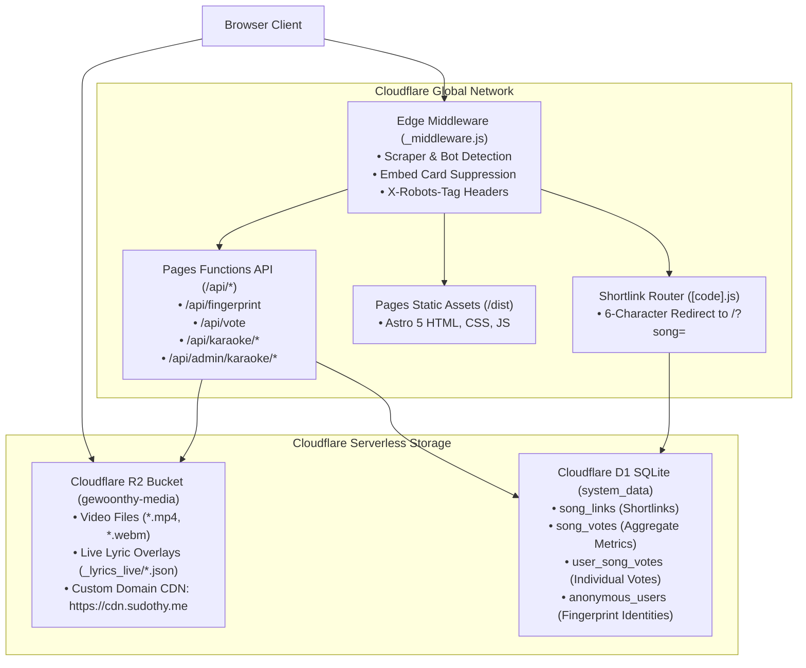
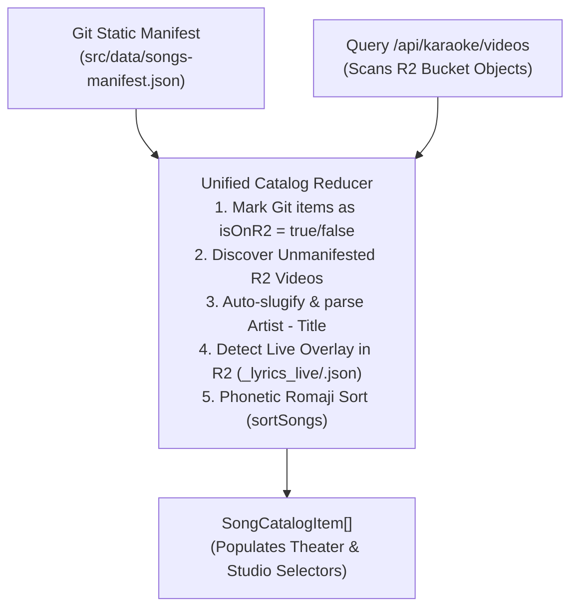

# 07. Cloud Infrastructure, Catalog Engine & Security Framework

> Architectural analysis of Cloudflare edge services (Pages, R2, D1), dynamic catalog unioning, phonetic Japanese Romaji sorting, iTunes artwork scoring, bot mitigation middleware, and passive browser fingerprinting.

---

## ☁️ Cloudflare Edge Infrastructure

Karaoke Theater leverages Cloudflare's serverless edge infrastructure to provide global low-latency distribution with zero server maintenance ([`wrangler.toml`](file:///home/thy/Projects/%E3%82%AB%E3%83%A9%E3%82%AA%E3%82%B1/wrangler.toml)).



---

## 📚 Unified Catalog Engine & Dynamic Overlays

The catalog engine ([`src/catalog/catalog.ts`](file:///home/thy/Projects/%E3%82%AB%E3%83%A9%E3%82%AA%E3%82%B1/src/catalog/catalog.ts)) unifies static Git metadata with live R2 cloud storage.

```typescript
export async function loadCatalog(): Promise<SongCatalogItem[]>
```

### The 3-Way Catalog Union Algorithm



1. **Git Manifest Mapping**: All tracks committed to `src/data/songs-manifest.json` are initialized.
2. **R2 Video & Overlay Audit**: The endpoint `/api/karaoke/videos` lists objects in the R2 bucket, separating media files from `_lyrics_live/*.json` keys.
3. **Dynamic Track Discovery**: If a video exists in R2 that has not yet been registered in Git, it is dynamically synthesized into a `SongCatalogItem`:
   - Artist and Title are extracted via `parseSongInfoFromFilename`.
   - A canonical slug is generated via `canonicalSongId`.
   - `hasLyrics` is marked `true` if an active `_lyrics_live/<slug>.json` file exists.
4. **Phonetic Sorting**: The combined collection is sorted alphabetically using non-destructive phonetic Romaji comparator keys.

### Two-Tier Lazy Lyric Loading
When a track is opened, `loadLyrics(songId)` queries:
1. **Live Overlay First**: Requests `/api/karaoke/lyrics?id=<id>` with `Cache-Control: no-cache`. If R2 contains a freshly saved overlay, it returns immediately.
2. **Vite Static Fallback**: If no live overlay exists, it executes the lazy-loaded Vite module `import.meta.glob('../data/lyrics/*.json')`.

---

## 🔤 Phonetic Japanese Romaji Sorting Engine

Sorting Japanese song titles alphabetically by standard Unicode code points produces unnatural results because Kanji sorting defaults to arbitrary radical/stroke ordering rather than phonetic pronunciation.

[`src/catalog/sorter.ts`](file:///home/thy/Projects/%E3%82%AB%E3%83%A9%E3%82%AA%E3%82%B1/src/catalog/sorter.ts) implements an internal **Hepburn Romaji Transliteration Engine**:

```typescript
export function getSortKey(item: { title: string; sortTitle?: string } | string): string
```

### Transliteration Features
- **Katakana Normalization**: Normalizes Katakana (`0x30A1`–`0x30F6`) to Hiragana (`0x3041`–`0x3096`).
- **Digraph Mapping (拗音 Yōon)**: Matches 2-character compounds (e.g. `きゃ` $\rightarrow$ `kya`, `しょ` $\rightarrow$ `sho`, `じゃ` $\rightarrow$ `ja`, `ぴょ` $\rightarrow$ `pyo`).
- **Sokuon (促音 `っ`)**: Detects small `っ` and automatically doubles the succeeding Romaji consonant (e.g. `ちょっと` $\rightarrow$ `chotto`).
- **Prolonged Sound Marks (`ー`)**: Automatically stripped.
- **Accent Decomposition**: Uses Unicode NFD to strip Latin diacritics (`É` $\rightarrow$ `E`).
- **Non-Destructive Guarantee**: Sort keys are strictly used inside `.sort()`; user-facing titles retain their original native typography.

---

## 🎨 Smart iTunes Search API Artwork Resolver

To display high-resolution album artwork without manually hosting image assets, [`src/catalog/itunes.ts`](file:///home/thy/Projects/%E3%82%AB%E3%83%A9%E3%82%AA%E3%82%B1/src/catalog/itunes.ts) queries the iTunes Search API.

### Result Scoring Algorithm
Standard search queries often return tribute bands, karaoke covers, or unintended remixes. The scoring algorithm evaluates candidate results:

$$\text{Score} = S_{\text{track}} + S_{\text{artist}} - P_{\text{remix}} - P_{\text{karaoke}}$$

| Condition | Delta | Description |
| :--- | :--- | :--- |
| Exact Track Name Match | `+100` | Normalized track title matches target exactly. |
| Substring Track Match | `+60` | Target title is contained within result title. |
| Exact Artist Match | `+50` | Normalized artist matches target exactly. |
| Substring Artist Match | `+30` | Target artist is contained within result artist. |
| Unsolicited Remix | `-40` | Result contains "remix" when original query did not request one. |
| Tribute / Karaoke / Cover | `-80` | Result collection contains "karaoke", "tribute", "lullaby", or "cover". |

### Regional Storefront Fallbacks
Non-Western or region-locked tracks (e.g. Japanese anime themes, French rap, Norwegian pop) fail on standard US storefront searches. The resolver automatically steps through regional storefronts:
$$\text{Fallback Sequence: } [\text{targetCountry}, \text{'gb'}, \text{'no'}, \text{'be'}, \text{'fr'}, \text{'jp'}, \text{'us'}]$$
Artwork is retrieved at $600\times600$ resolution (`600x600bb.jpg`) and cached in `sessionStorage` and memory.

---

## 🛡️ Bot Mitigation & Embed Suppression Middleware

To prevent social networks, web spiders, and AI crawlers from generating rich preview cards or indexing private media, [`functions/_middleware.js`](file:///home/thy/Projects/%E3%82%AB%E3%83%A9%E3%82%AA%E3%82%B1/functions/_middleware.js) intercepts incoming requests:

```javascript
const isScraper = /facebookexternalhit|Facebot|facebookcatalog|meta-externalagent|Twitterbot|Discordbot|TelegramBot|WhatsApp|LinkedInBot|Slackbot|Applebot|Googlebot|bingbot|bot|crawl|spider/i.test(ua);

if (isScraper) {
  return new Response('', {
    status: 200,
    headers: {
      'Content-Type': 'text/plain',
      'X-Robots-Tag': 'noindex, nofollow, nosnippet, noimageindex, noarchive',
      'Cache-Control': 'no-cache, no-store, must-revalidate'
    }
  });
}
```
Chat applications receive an empty 200 plain text response, causing link preview generators to produce **zero embed cards**.

---

## 🔍 Passive Browser Fingerprinting & View Counting

To enable persistent user voting and play counts without intrusive login walls or tracking cookies, the system uses passive identity synthesis.

### 1. 12-Source Client Entropy Collection ([`src/fingerprint/fingerprint.ts`](file:///home/thy/Projects/%E3%82%AB%E3%83%A9%E3%82%AA%E3%82%B1/src/fingerprint/fingerprint.ts))
Signals are collected in parallel via `Promise.allSettled`:
- **Canvas 2D Hash**: Off-screen drawing of complex glyphs, alpha fills, and Bézier curves.
- **WebGL Capabilities**: GPU vendor, unmasked renderer, max texture size, and vertex shader float precision.
- **OfflineAudioContext**: 256-sample audio compressor dynamics response.
- **Math FPU Quirks**: Subtle floating-point variations across CPU architectures:
  ```typescript
  Math.tan(-1e300), Math.sin(Math.PI), (Math.sqrt(2) * Math.log(1e-10))
  ```
- **System Metrics**: Installed font metric baselines, speech synthesis voice registries, screen/taskbar geometry, locale number format decimal separators, and CSS media queries.

### 2. Edge Signal Blending ([`functions/api/fingerprint.ts`](file:///home/thy/Projects/%E3%82%AB%E3%83%A9%E3%82%AA%E3%82%B1/functions/api/fingerprint.ts))
The server hashes client entropy with its own network observations:
$$\text{ServerSig} = \text{IP} \parallel \text{Country} \parallel \text{ASN} \parallel \text{UserAgent} \parallel \text{TLSCipher} \parallel \text{TLSVersion}$$
$$\text{CombinedHash} = \text{SHA256}(\text{ClientHash} \parallel \text{"::"} \parallel \text{SHA256}(\text{ServerSig}))$$
The first 8 bytes of the combined hash are encoded into a `kr-XXXX-XXXX` identifier and registered in D1.

### 3. Genuine Play View Counting (5.47-Second Threshold)
To prevent playlist clicking or accidental taps from inflating play counts:
- The theater player enforces a **continuous genuine-play threshold of 5.47 seconds** ($5,470\text{ms}$).
- If the user pauses the video, the timer stops and accumulates time; resuming does not reset the clock.
- Only once cumulative active playback exceeds 5.47s does the client fire `/api/vote` with `{ count_view: true }`, atomically incrementing both `song_votes.views` and `anonymous_users.views`.
