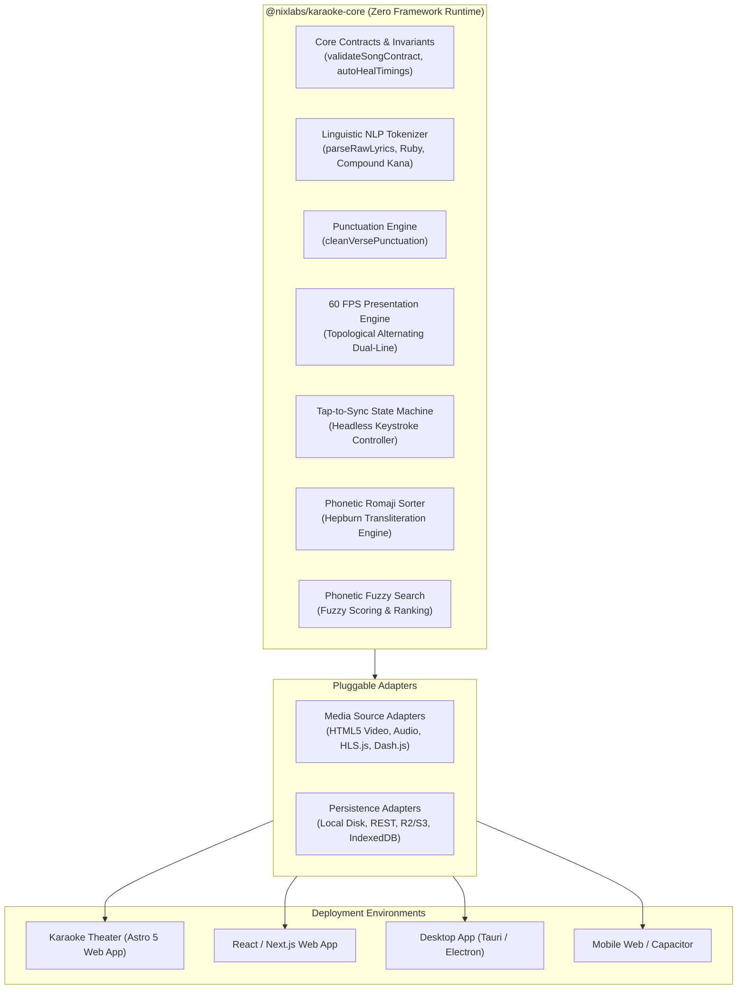

# 08. Standalone Engine Blueprint & Headless SDK Extraction

> Blueprint for decoupling the core presentation, synchronization, and linguistic engine into a framework-agnostic headless SDK (`@nixlabs/karaoke-core`).

---

## 🧩 Architectural Decoupling Strategy

The core presentation, synchronization, and typography subsystems in Karaoke Theater are architected with **zero dependencies on Astro, Cloudflare, or UI frameworks**. They can be extracted cleanly into an independent, headless TypeScript library suitable for npm distribution or embedding into React, Vue, Svelte, Electron, or Tauri applications.



---

## 📦 Package Modularization Plan

### Proposed Package: `@nixlabs/karaoke-core`

```
@nixlabs/karaoke-core/
├── contracts/             # Schemas, validation rules, timing auto-healer
├── tokenizer/             # CJK tokenizer, Yomitan ruby parser, slugifier
├── punctuation/           # Punctuation auto-merging state machine
├── renderer/              # 60 FPS dual-line render loop & clip-path wiper
├── studio/                # Headless tap-to-sync state machine
├── sorter/                # Hepburn Romaji transliteration & comparator keys
├── search/                # Phonetic fuzzy search
└── types/                 # Canonical Word, Verse, SongMetadata models
```

### Zero-Dependency Guarantee
The proposed package depends solely on standard Web APIs:
- `requestAnimationFrame` and `cancelAnimationFrame`
- `Intl` and `String.prototype.normalize`
- Web Crypto API (`crypto.subtle`)

---

## 🔌 Headless API Specifications

### 1. Presentation Controller (`createKaraokeEngine`)
Decouples visual presentation from specific DOM element structures:

```typescript
export interface KaraokeEngineConfig {
  mediaElement: HTMLMediaElement; // HTMLVideoElement or HTMLAudioElement
  containerElement: HTMLElement;
  topLineElement: HTMLElement;
  bottomLineElement: HTMLElement;
  lyricsData: Verse[];
  globalOffset?: number;
  leadInSeconds?: number;        // Defaults to 4.0
  fadeOutGrace?: number;         // Defaults to 0.6
  onVerseChange?: (activeVerseIndex: number) => void;
}

export interface KaraokeEngineController {
  destroy: () => void;
  setLyrics: (lyrics: Verse[]) => void;
  setOffset: (offset: number) => void;
  getCurrentVerseIndex: () => number;
}

export function createKaraokeEngine(config: KaraokeEngineConfig): KaraokeEngineController;
```

### 2. Headless Synchronization State Machine (`createSyncSession`)
Provides synchronization logic independent of any UI buttons or cards:

```typescript
export interface SyncSessionConfig {
  mediaElement: HTMLMediaElement;
  initialLyrics: Verse[];
  globalOffset?: number;
  onWordStamped?: (vIdx: number, wIdx: number, timestamp: number) => void;
  onVerseCompleted?: (vIdx: number, verse: Verse) => void;
  onStateChange?: (state: SyncSessionState) => void;
}

export interface SyncSessionController {
  tap: () => void;               // Invoked on Spacebar or UI tap
  undo: () => void;              // Invoked on Backspace
  deleteVerse: () => void;       // Invoked on Shift+Backspace
  nudge: (deltaSeconds: number) => void; // Invoked on [ or ]
  setTarget: (vIdx: number, wIdx: number) => void;
  getPayload: () => SaveLyricsPayload;
}

export function createSyncSession(config: SyncSessionConfig): SyncSessionController;
```

### 3. Pluggable Persistence Adapter Interface
```typescript
export interface PersistenceAdapter {
  saveLyrics(payload: SaveLyricsPayload): Promise<{ success: boolean; error?: string }>;
  loadLyrics(songId: string): Promise<SongLyricFile | null>;
}

// Built-in adapter implementations:
export class RestPersistenceAdapter implements PersistenceAdapter { ... }
export class IndexedDBPersistenceAdapter implements PersistenceAdapter { ... }
export class LocalStoragePersistenceAdapter implements PersistenceAdapter { ... }
```

---

## 💻 Framework Integration Recipes

### React Hook Integration Pattern
```tsx
import React, { useEffect, useRef } from 'react';
import { createKaraokeEngine, type Verse } from '@nixlabs/karaoke-core';

export function KaraokePlayer({ videoUrl, verses }: { videoUrl: string; verses: Verse[] }) {
  const videoRef = useRef<HTMLVideoElement>(null);
  const containerRef = useRef<HTMLDivElement>(null);
  const topLineRef = useRef<HTMLDivElement>(null);
  const bottomLineRef = useRef<HTMLDivElement>(null);

  useEffect(() => {
    if (!videoRef.current || !containerRef.current || !topLineRef.current || !bottomLineRef.current) {
      return;
    }

    const engine = createKaraokeEngine({
      mediaElement: videoRef.current,
      containerElement: containerRef.current,
      topLineElement: topLineRef.current,
      bottomLineElement: bottomLineRef.current,
      lyricsData: verses,
    });

    return () => engine.destroy();
  }, [verses]);

  return (
    <div className="karaoke-viewport">
      <video ref={videoRef} src={videoUrl} controls />
      <div ref={containerRef} className="lyrics-stage-container">
        <div ref={topLineRef} className="k-line k-line-top" />
        <div ref={bottomLineRef} className="k-line k-line-bottom" />
      </div>
    </div>
  );
}
```

---

## 🔮 Future Technical Roadmap

### 1. Real-Time Pitch Detection & Vocal Scoring
- **Web Audio Worklet**: Integrate a low-latency Web Audio Worklet running the YIN or autocorrelation algorithm on microphone input.
- **Pitch Contour Matching**: Compare user pitch curves against MIDI/pitch metadata in real time, rendering note guide bars and gamified accuracy scores.

### 2. Multi-Track Stems & Backing Vocal Isolation
- **Demucs 4-Stem Model**: Extend the Python alignment pipeline to output complete stems (`vocals.wav`, `drums.wav`, `bass.wav`, `other.wav`).
- **Client Stem Player**: Use Web Audio API `AudioContext` with multiple synchronized buffer sources, giving users a live slider to adjust backing vocal levels from full vocals to pure instrumental karaoke.

### 3. Collaborative Real-Time Synchronization
- **Cloudflare Durable Objects**: Implement WebSocket rooms where multiple contributors can review and fine-tune word timings simultaneously.
- **Conflict-Free Synchronization**: Use operational transformation (OT) to ensure simultaneous timestamp edits merge deterministically without overwriting concurrent adjustments.
