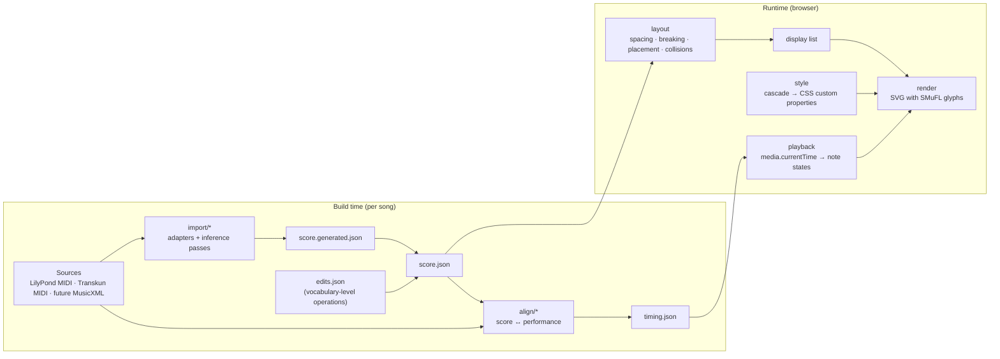

# 09. Notation Engine

> Specification for a song-agnostic piano notation engine: the notation catalogue, the behaviour of every entry on its own and next to others, the score model, import inference, layout, styling, and the playback contract. **Status: draft for review. Nothing here is implemented yet.**

---

## 1. Principles

1. **No song-specific code.** Engine code never mentions a song, a bar number, a note ID or a pitch chosen for one piece. If a song can only be engraved correctly by adding code that targets it, the engine has a gap, and the fix is a general rule or a new catalogue entry.
2. **Song-specific data is the score.** A MIDI file does not contain arpeggio signs, slurs, fermatas, expression text or enharmonic spelling. That information lives in the song's score data, written only in the catalogue's vocabulary ("arpeggio on the chord at bar 167, beat 1"). Data can never carry drawing instructions ("move this 4 px down"). A need for a visual nudge is a layout-rule bug.
3. **Rules are parametric.** Inference and layout rules may depend on meter, key, tempo, register, density, staff, voice and neighbouring notation. Never on position in a particular piece.
4. **Semantic, then visual.** The score model says *what* is written. Layout decides *where* it goes. Rendering decides *how it looks*. Styling decides *what colour*. Playback decides *when it lights up*. None of these layers reaches into another's job.
5. **Timing is not part of the score.** The score has no seconds in it. A separate timing map links note IDs to media time.
6. **Inference runs at build time.** The browser loads a finished score per song and only lays out, draws and animates it.
7. **Every catalogue entry is demonstrable.** Each entry has examples that appear in the notation gallery and in snapshot tests. An entry without a passing example is not finished.

---

## 2. Architecture



| Module | Owns | Must not know about |
| :--- | :--- | :--- |
| `notation/catalogue` | One entry per notation (grouped in a file per family): its type, glyphs, defaults, examples. A registry indexes them. | Songs, media, colours |
| `notation/rules` | Placement, stacking, spacing, interaction and break rules, shared by all entries | Songs, media, colours |
| `score/model` | Score document types, stable IDs, validation, edit operations | Layout, pixels, media |
| `import/*` | Source adapters and inference passes that produce a score | Layout, rendering |
| `align/*` | Matching performed notes to score notes, producing `timing.json` | Layout, rendering |
| `layout` | Measure widths, line and page breaking, vertical placement, collision avoidance, the display list | Media time, colours |
| `render` | Turning the display list into SVG; the SMuFL font is used only here | Score inference, media time |
| `style` | Resolving colours and opacity per element and state from the style cascade | Positions, media time |
| `playback` | Note states (upcoming, active, played) and glide progress from `media.currentTime` and `timing.json` | Positions of anything except what render hands it |

**No VexFlow.** The engine draws Bravura (SMuFL) glyphs itself, from glyph boxes measured out of the font file by `scripts/notation/build-fonts.py` into `src/notation/fonts/metrics.json`. Every placement decision is made by `layout`, and because layout needs no DOM it runs the same in the browser and in Node tests. Fonts (Bravura, Academico; SIL Open Font License) are served from `public/fonts/`.

---

## 3. Score model

### 3.1 Time

- All durations and positions are **exact fractions of a whole note** (`Fraction { n, d }`). No ticks, no floating point. A triplet eighth is `1/12`; a 7:6 sixteenth is `1/28`.
- A position is `(measure, offset)`, where `offset` is a fraction from the start of the measure.
- Tuplets are explicit objects with a ratio `actual:normal` (3:2, 6:4, 7:6, …) and a base unit. An event's sounding duration is its written value × `normal/actual` of every enclosing tuplet.

### 3.2 Hierarchy

```
Score
 ├─ meta: title, composer, edition, source provenance
 ├─ parts[]            (piano = one part)
 │   └─ staves[]       (piano = upper, lower)
 ├─ measures[]
 │   ├─ number, displayNumber, pickup?, timeSignature?, keySignature?, barlineLeft/Right
 │   └─ per staff:
 │       ├─ clef changes at offsets
 │       └─ voices[]
 │           └─ events[]: Chord | Rest | Space (invisible) with graces[]
 ├─ spanners[]         (ties, slurs, hairpins, ottavas, pedals, tuplets, trill lines, voltas, tempo-change lines …)
 ├─ attachments[]      (articulations, ornaments, dynamics, fingerings, arpeggios, text … attached to an event, note or position)
 ├─ navigation         (repeats, voltas, segno, coda, jumps) → performance order
 └─ roles, tags        (song-defined semantic labels for styling and playback)
```

- A **Chord** has one or more **Notes** sharing an onset, a written value and a stem. A single note is a one-note chord.
- A **Note** has a spelled pitch (`step`, `alter`, `octave`), an optional displayed accidental, a staff (for cross-staff notes) and optional tie-start.
- A **Space** occupies time in a voice without drawing anything. It is how a secondary voice that pauses avoids a stray rest.

### 3.3 Identity

- Every event, note, spanner and attachment has a **stable ID** that survives re-import as long as the musical content at that position is unchanged.
- Edits reference those IDs. If a re-import removes an edit's target, the build **fails loudly** and names the edit.
- **Performance instances**: when navigation repeats material, each note has one score ID and one instance per performed pass (`noteId#1`, `noteId#2`). The timing map is keyed by instance.

### 3.4 Provenance

Every element records where it came from: `imported` (stated by the source), `inferred` (decided by an inference pass, with a confidence 0–1 and the rule's name) or `edited` (from `edits.json`). The review gallery can highlight low-confidence inferences.

### 3.5 Roles and tags

A song may declare **roles** (e.g. `melody`, `response`, `accompaniment`, `bass-line`) and free-form **tags**, and assign them to events, notes, voices, staves or measure ranges. The engine attaches no meaning to role names. Styling and playback select on them.

---

## 4. Behaviour vocabulary

Every catalogue entry is specified along the same dimensions.

| Dimension | Meaning |
| :--- | :--- |
| **Anchor** | What it attaches to: `note`, `chord`, `stem`, `event` (chord or rest), `position` (measure + offset), `span` (start → end), `measure`, `barline`, `staff`, `system`. |
| **Side** | Where it goes relative to its anchor. Usually derived from stem direction, voice or staff. |
| **Layer** | Its rank when several marks compete for the same side of the same anchor (see §4.1). |
| **Spacing** | Horizontal room it claims before or after its anchor, which changes measure width. |
| **Collision** | Its collision class: what it may overlap, and who moves when it can't. |
| **Breaks** | What happens when its span crosses a line or page break. |
| **Size** | Which size classes apply (§4.2). |
| **Interactions** | Rules that depend on other notation near it. |
| **Playback** | Effect on highlight timing. With audio alignment, real timing always wins. This defines fallbacks and how a mark shows while playing. |
| **Inference** | Whether and how an import pass may create it. |

### 4.1 Vertical layers

Outward from the notehead, on the side a mark is placed:

| Layer | Contents |
| :---: | :--- |
| 0 | Noteheads, accidentals, augmentation dots, stems, flags, beams |
| 1 | Staccato, staccatissimo, tenuto, portato (inside the staff when they fit in a space, never on a line) |
| 2 | Accent (inside a slur when it fits, otherwise outside) |
| 3 | Ties and slurs |
| 4 | Marcato, ornaments, tremolo-independent marks, fingering |
| 5 | Fermata (always outermost of the note-attached marks) |
| 6 | Tuplet numbers and brackets |
| 7 | Staff-level lines: ottava, trill extension lines, pedal lines, hairpins and dynamics (on their own baselines, §4.3) |
| 8 | System-level: tempo, rehearsal marks, voltas, navigation text |

A mark never jumps over a mark of a lower layer that it would otherwise collide with. Lower layers are placed first; higher layers pack outward against a **skyline** (the outer contour of everything already placed).

### 4.2 Size classes

All distances are in **staff spaces (sp)**, the distance between two staff lines.

| Class | Scale | Used for |
| :--- | :---: | :--- |
| `full` | 1.0 | Normal notation, clefs at a line start |
| `change` | 0.75 | Clef changes within a line, courtesy clefs at a line end |
| `cue` | 0.75 | Cue notes and their marks |
| `grace` | 0.6 | Grace notes, their accidentals, beams, slashes and ornament accidentals |
| `small-text` | 0.7 | Bar numbers, fingering, ornament accidentals |

A size class scales the glyph and all of its own spacing, stem lengths and beam thickness. It does not scale the staff.

### 4.3 Shared baselines

For readability, some marks line up across a whole line of music rather than hugging each note:

- **Dynamics line**: dynamics and hairpins on the same side of a staff share one baseline per line, placed at the lowest (or highest) point the skyline requires.
- **Pedal line**: all pedal marks of a line share one baseline below the lower staff.
- **Ottava line**: one height per span, clearing every note under it.
- **Tempo line**: tempo marks, rehearsal marks and voltas of one line share the space above the system.

---

## 5. Catalogue

Entry IDs are `family.name`. Glyph names are SMuFL names in the Bravura font and are verified against the font metadata at implementation time.

### 5.1 Staff and system

| ID | Notation | Glyph |
| :--- | :--- | :--- |
| `staff.lines` | Five-line staff | — (drawn) |
| `staff.ledger` | Ledger lines | — (drawn) |
| `staff.brace` | Grand-staff brace | `brace` |
| `staff.bracket` | System bracket (reserved for multi-part systems) | `bracket` |
| `staff.system-line` | Line joining the staves at the start of a system | — |
| `barline.single` | Single barline | — |
| `barline.double` | Double barline (section end, key change) | — |
| `barline.final` | Final (thin–thick) barline | — |
| `barline.dashed` | Dashed barline | — |
| `staff.bar-number` | Bar number | text |

- **Ledger lines** extend past each side of the notehead by the font's ledger-line extension (0.4 sp in Bravura). Adjacent ledger lines of a chord share one length per line. Notes in a second (offset noteheads) widen the ledger line to cover both.
- **Barlines** in a grand staff run through both staves and the gap between them. A barline at the end of the last measure of a line belongs to that line; a repeat-start barline after a break moves to the start of the next line.
- **Double barline** is drawn automatically before a key change and wherever the score marks a section end.
- **Bar numbers** appear above the upper staff at the start of every line except the first, left-aligned to the system, `small-text` size. Pickup measures are number 0 and never show a number.
- **Inference**: barlines and measures come from the meter (§7.3). Final barline at the end of the score.

### 5.2 Clefs

| ID | Notation | Glyph |
| :--- | :--- | :--- |
| `clef.treble` | Treble (G) clef | `gClef` |
| `clef.bass` | Bass (F) clef | `fClef` |
| `clef.alto` | Alto (C on line 3) | `cClef` |
| `clef.tenor` | Tenor (C on line 4) | `cClef` |
| `clef.treble-8vb` | Treble clef sounding an octave lower | `gClef8vb` |
| `clef.treble-8va` | Treble clef sounding an octave higher | `gClef8va` |
| `clef.bass-8vb` | Bass clef sounding an octave lower | `fClef8vb` |
| `clef.baritone-f` | Baritone (F on line 3) | `fClef` |

- **Size**: `full` at the start of every line. `change` when the clef changes within a line. `change` again as a **courtesy clef** at the end of a line when the next line starts with a new clef.
- **Position**: a change at the start of a measure is drawn *before* the barline of that measure (at the end of the previous one). A change in the middle of a measure is drawn immediately before the event it applies to, after any preceding barline, and claims horizontal space.
- **Interactions**: a clef change never sits between a grace note and its main note; it moves before the grace group. A clef change applies only to its staff, including cross-staff notes drawn on that staff.
- **Inference**: a staff changes clef when a passage of at least N beats would need more than K ledger lines in the current clef and fewer in the other, with hysteresis so it doesn't flip back and forth (N, K in the song's import settings, with engine defaults). An octave line is preferred over a clef change when the passage stays within the clef's natural range plus an octave (§5.16).

### 5.3 Key signatures

| ID | Notation |
| :--- | :--- |
| `key.signature` | Key signature, −7 to +7 fifths, major or minor mode |
| `key.change` | Key change within the piece, with optional cancelling naturals |
| `key.courtesy` | Courtesy key signature at the end of a line before a change |

- **Order**: sharps F C G D A E B; flats B E A D G C F. Vertical positions are fixed per clef (the standard zig-zag patterns, including the different sharp pattern in tenor clef).
- **Drawn** at the start of every line after the clef. At a change: preceded by a double barline.
- **Cancelling naturals**: when the new key has fewer accidentals of the same kind, or switches between sharps and flats, naturals cancel the old ones before the new signature. A song setting chooses `traditional` (always cancel) or `modern` (cancel only when switching to C major or between sharps and flats).
- **Interactions**: the key signature feeds the accidental rule (§6.2) and pitch spelling (§7.6).
- **Inference**: from the source's key-signature events (LilyPond MIDI has them), else from song meta, else estimated from pitch-class distribution. Mode affects spelling only.

### 5.4 Time signatures

| ID | Notation | Glyph |
| :--- | :--- | :--- |
| `time.numeric` | Stacked numerals: 2/4, 3/4, 4/4, 5/4, 6/4, 2/2, 3/2, 3/8, 6/8, 9/8, 12/8, and any n/d | `timeSig0`–`timeSig9` |
| `time.common` | Common time (C) | `timeSigCommon` |
| `time.cut` | Cut time (₵) | `timeSigCutCommon` |
| `time.courtesy` | Courtesy time signature at the end of a line before a change | — |

- **Drawn** on the first line only, then only at changes. Centred vertically on each staff of the grand staff.
- **Meter vs symbol**: the model stores meter (beats, beat unit, grouping, e.g. `6/8 = 2 × dotted quarter`) separately from the symbol. ₵ is `2/2` with symbol `cut`; C is `4/4` with symbol `common`. Beaming and directions use the meter, never the symbol.
- **Interactions**: drives beaming (§6.4), rest grouping, tie splitting (§6.5), bar width and the beat clock for glides.
- **Inference**: MIDI time-signature events are **untrusted** (LilyPond writes 4/4 for ₵; Transkun writes 4/4 for everything). The song's import settings state the meter and symbol per section; the importer validates that the bar lengths fit the source and fails if they don't.

### 5.5 Notes

| ID | Notation | Glyph |
| :--- | :--- | :--- |
| `note.head` | Whole, half and black noteheads (also breve, reserved) | `noteheadWhole`, `noteheadHalf`, `noteheadBlack` |
| `note.stem` | Stem | — |
| `note.flag` | Flags, eighth to 128th, up and down | `flag8thUp` … `flag128thDown` |
| `note.dot` | Augmentation dot (single, double) | `augmentationDot` |
| `note.chord` | Chord: several noteheads on one stem | — |
| `note.beam` | Beams: primary, secondary, broken (fractional), cross-staff | — |
| `note.cross-staff` | Note or chord drawn on the other staff of the grand staff | — |
| `note.voices` | Two or more voices on one staff | — |

- **Stem direction** (§6.3). **Stem length** 3.5 sp; notes with ledger lines extend the stem to the middle line; 32nds and shorter lengthen by 0.5 sp per extra flag; stems in a secondary voice may shorten to 2.75 sp.
- **Seconds in chords**: noteheads a second apart sit on opposite sides of the stem, the lower note on the left for up-stems. Clusters alternate. Unisons between voices share a notehead when value and notehead type match; otherwise they offset.
- **Augmentation dots** go in the space to the right of the notehead; a note on a line puts its dot in the space above (for the lower voice, below). In a chord, dots never share a space; colliding dots move outward. Dots of all notes of a chord align in one column.
- **Beams**: see §6.4. Beam thickness 0.5 sp, gap 0.25 sp; slant follows the outer notes, capped at 1 sp per group (less for groups within a small range); horizontal for repeated patterns that return to the same pitch. Cross-staff beams sit between the staves, with stems on both sides (kneed beam).
- **Cross-staff notes** stay in their original voice (for rhythm and beaming) but are drawn on the other staff. Horizontal spacing for both staves is shared, so they align.
- **Voices**: voice 1 stems up, voice 2 stems down, regardless of pitch. Rests of a voice move toward that voice's side (§5.7). When one voice holds a note during another's run, both remain visible.
- **Inference**: chords from simultaneous onsets within a voice; voices from §7.5; cross-staff from §7.4.

### 5.6 Grace and cue notes

| ID | Notation | Glyph |
| :--- | :--- | :--- |
| `grace.acciaccatura` | Slashed grace note, played crushed in | `graceNoteAcciaccaturaStemUp` / `…StemDown` |
| `grace.appoggiatura` | Unslashed grace note, takes value from the main note | `graceNoteAppoggiaturaStemUp` / `…StemDown` |
| `grace.group` | Several grace notes beamed together (usually 16th beams) | — |
| `grace.after` | After-grace notes (Nachschlag, e.g. a trill's termination) | — |
| `cue.note` | Cue-sized note showing another part (reserved) | — |

- **Size** `grace`. Stems up in a single-voice context; in multi-voice contexts they follow their voice. A slash crosses the stem (and the beam of a group's first note for a slashed group).
- **Spacing**: grace notes take horizontal room *before* their main note, to the left of the main note's accidentals and arpeggio; they don't count toward the bar's duration. After-graces take room after their note and before the next event.
- **Interactions**: a grace note has its own accidental, which does **not** carry to the main note or the rest of the bar per the accidental rule (it is drawn, but the carry rule applies only from full-size notes onward; a song setting can change this). An optional slur joins a grace group to its main note. A clef change goes before the grace group, never between it and the main note.
- **Playback**: with alignment, graces have their own audio times. Fallback: acciaccaturas just before the beat, appoggiaturas on the beat taking half the main note's value.
- **Inference**: very short notes (shorter than a configurable fraction of the local beat) leading into a longer note on a beat, not fitting the bar's metric grid, become grace notes. An onset-before-beat cluster becomes an acciaccatura group.

### 5.7 Rests

| ID | Notation | Glyph |
| :--- | :--- | :--- |
| `rest.whole` | Whole rest | `restWhole` |
| `rest.half` | Half rest | `restHalf` |
| `rest.quarter` | Quarter rest | `restQuarter` |
| `rest.8th` | Eighth rest | `rest8th` |
| `rest.16th` | 16th rest | `rest16th` |
| `rest.32nd` | 32nd rest | `rest32nd` |
| `rest.64th` | 64th rest | `rest64th` |
| `rest.128th` | 128th rest | `rest128th` |
| `rest.dotted` | Dotted and double-dotted rests | `augmentationDot` |
| `rest.full-bar` | Full-bar rest (whole-rest glyph centred in any meter) | `restWhole` |
| `rest.multi-bar` | Multi-bar rest with a count | `restHBar` + numerals |
| `rest.hidden` | Invisible time (a `Space` event) | — |

- **Position**: whole rest hangs from line 4, half rest sits on line 3, others centred on the middle. In multiple voices, rests shift by whole staff spaces toward their voice's side until clear; whole and half rests outside the staff get a short ledger line.
- **Full-bar rest** is centred horizontally in the bar, whatever the meter. A voice that is silent for a whole bar while another voice plays is a `Space`, not a rest, unless the song says otherwise.
- **Grouping**: rests follow the meter's beat structure (§6.5): never a rest that hides a beat in compound meters; in 4/4 a half rest may cover beats 1–2 or 3–4, never 2–3.
- **Rests in beams** break the beam by default. A song setting allows beaming over rests within a beat.
- **Multi-bar rest**: consecutive full-bar rests in *all* staves of a system collapse into one, unless interrupted by a barline type, key, clef, time or rehearsal change. Rare in piano; kept for completeness.
- **Fermata on a rest** is centred over the rest (§5.11).

### 5.8 Accidentals

| ID | Notation | Glyph |
| :--- | :--- | :--- |
| `acc.sharp` | Sharp ♯ | `accidentalSharp` |
| `acc.flat` | Flat ♭ | `accidentalFlat` |
| `acc.natural` | Natural ♮ | `accidentalNatural` |
| `acc.double-sharp` | Double sharp 𝄪 | `accidentalDoubleSharp` |
| `acc.double-flat` | Double flat 𝄫 | `accidentalDoubleFlat` |
| `acc.courtesy` | Courtesy accidental in parentheses | `accidentalParensLeft/Right` |

- **When drawn**: the accidental rule (§6.2). A note shows an accidental only when its alteration differs from what the key and earlier notes in the bar imply.
- **Spacing**: accidentals take room before the note, after any grace notes and arpeggio-sign room. 0.2 sp gap from the notehead.
- **Chords**: accidentals stack in columns with the standard zig-zag order (top, bottom, second from top, second from bottom, …). Accidentals a seventh or more apart may share a column. Flats may tuck into the space of a sharp's notch where their shapes allow.
- **Courtesy accidentals**: a song setting chooses when to add them (none / after a tie across a barline / in the bar after an altered pitch / at the same pitch in another octave in the same bar).
- **Inference**: pitch spelling decides which accidental a pitch uses (§7.6); the accidental rule decides whether it is drawn.

### 5.9 Tuplets

| ID | Notation |
| :--- | :--- |
| `tuplet.number` | Tuplet number (3, 5, 6, 7, …) |
| `tuplet.bracket` | Tuplet bracket |
| `tuplet.ratio` | Ratio display (e.g. 7:6) |
| `tuplet.nested` | Tuplet inside a tuplet |

- **Side**: on the beam side for beamed groups (opposite the noteheads), otherwise on the stem side. A song can force a side for a voice; per-tuplet overrides are edits.
- **Bracket**: omitted when the whole tuplet is one beam group with no other notes under the beam; drawn otherwise (unbeamed notes, rests at the ends, partial beams).
- **Number display**: a bare number when the ratio is the conventional one (3 in place of 2, 5–7 in place of 4, …), a ratio when it isn't. A song can hide numbers after the pattern is established (`simile`-style policy: first N occurrences per passage shown, rest hidden).
- **Layer** 6: outside articulations; inside slurs when the slur spans more than the tuplet, outside when shorter.
- **Breaks**: tuplets never cross a barline.
- **Inference**: §7.3. The quantizer considers tuplet grids per beat and chooses the simplest grid that fits all onsets in that beat within tolerance.

### 5.10 Connections

| ID | Notation |
| :--- | :--- |
| `tie` | Tie between two notes of the same pitch |
| `tie.lv` | Laissez-vibrer tie (short, open-ended) |
| `slur` | Slur |
| `slur.phrasing` | Phrasing slur containing shorter slurs |
| `gliss` | Glissando line (straight or wavy) |

- **Ties**: curve away from the stem. In a chord, the upper half of the notes tie upward and the lower half downward; a middle note follows its nearest neighbour's direction away from the centre. Endpoints start and end at the notehead sides, at the height of the note, staying clear of staff lines (raised or lowered into a space). Ties also cross dots and accidentals without collision. Ties across a barline need no accidental on the tied note.
- **Ties across breaks**: split into a half tie leaving the last note of the line and a half tie arriving at the first note of the next line.
- **Slurs**: endpoints attach to noteheads on the notehead side and to stem ends on the stem side. A slur lies above all layer 1–2 marks it encloses and avoids everything within its span by raising its arch, up to a maximum height, beyond which the endpoints move instead. Slurs over a line or page break split, with each part ending a short way past the last note or starting before the first note of its line.
- **Phrasing slurs** sit outside any shorter slurs they contain.
- **Interactions**: staccato and tenuto at a slur end sit inside the slur; accents inside when they fit, otherwise outside. Fermatas, ornaments and tuplet numbers of shorter spans go inside a long slur; tuplet numbers of longer spans go outside.
- **Playback**: none (ties merge highlight into one sounding note; see §10).
- **Inference**: ties from durations that cross a barline or a beat boundary that must be shown (§6.5). Slurs are not inferred from MIDI; they come from edits or a richer source.

### 5.11 Articulations

| ID | Notation | Glyph |
| :--- | :--- | :--- |
| `artic.staccato` | Staccato dot | `articStaccatoAbove/Below` |
| `artic.staccatissimo` | Staccatissimo (wedge) | `articStaccatissimoWedgeAbove/Below` |
| `artic.tenuto` | Tenuto line | `articTenutoAbove/Below` |
| `artic.portato` | Portato (tenuto + staccato) | `articTenutoStaccatoAbove/Below` |
| `artic.accent` | Accent (>) | `articAccentAbove/Below` |
| `artic.marcato` | Marcato (^) | `articMarcatoAbove/Below` |
| `artic.fermata` | Fermata, short / normal / long, above or below | `fermataShortAbove`, `fermataAbove`, `fermataLongAbove`, `…Below` |
| `artic.fermata-barline` | Fermata over a barline (a pause between sections) | `fermataAbove` |

- **Anchor**: chord (one mark per chord, not per note).
- **Side**: staccato, staccatissimo, tenuto, portato and accent go on the **notehead side** (opposite the stem); with multiple voices, they go on the voice's own stem side. Marcato and fermata always go **above** the staff for voice 1 and a single voice, below for voice 2 (fermatas flip to the `Below` glyph).
- **Inside the staff**: layer-1 marks may sit in a staff space when they fit, centred on the notehead (or on the stem when on the stem side), never on a line. Accents and above sit outside the staff.
- **Combining**: a tenuto and a staccato on one chord become a single portato glyph. Several marks stack in layer order (§4.1), staccato nearest.
- **Fermata on a rest** centres on the rest. **Fermata on a barline** centres over the barline above the system.
- **Playback**: none drawn. With alignment, real durations show the effect. A fermata extends the glide window of its chord until the next attack.
- **Inference**: optional and off by default (staccato from very short durations relative to the written value; accents from velocity peaks). Inferred articulations carry low confidence.

### 5.12 Ornaments

| ID | Notation | Glyph |
| :--- | :--- | :--- |
| `orn.trill` | Trill sign *tr* | `ornamentTrill` |
| `orn.trill-line` | Trill extension (horizontal wavy line) | `wiggleTrill` |
| `orn.mordent` | Mordent (lower) | `ornamentMordent` |
| `orn.inverted-mordent` | Inverted mordent / Pralltriller (upper) | `ornamentShortTrill` |
| `orn.turn` | Turn | `ornamentTurn` |
| `orn.inverted-turn` | Inverted turn | `ornamentTurnInverted` |
| `orn.turn-after` | Turn placed between two notes (after a note) | `ornamentTurn` |
| `orn.accidental` | Small accidental above/below an ornament | `accidentalSharp`… (`small-text`) |
| `orn.tremolo` | Single-note tremolo, 1–4 strokes | `tremolo1`–`tremolo4` |
| `orn.tremolo-between` | Two-note (alternating) tremolo between notes | — (beam-like strokes) |

- **Side**: above the staff (below for voice 2). Layer 4.
- **Trill line**: starts right after the *tr*, wiggles until the end of the trilled note's value (or an explicit end), ending before the next event. Over a break, it continues on the next line without a new *tr* (a song setting may reprint "(tr)").
- **Ornament accidentals**: above the ornament for the upper auxiliary, below for the lower; size `small-text`.
- **Turn-after**: horizontally between the anchor note and the next event, not over the note.
- **Tremolo strokes** cross the stem (on a whole note, float where the stem would be). Two-note tremolo: strokes between the stems of a pair whose written values each equal the full duration.
- **Playback**: with alignment, the many performed notes of a trill or tremolo are linked to the one written note; its highlight runs from the first performed attack to the last release.
- **Inference**: §7.7 detects trills (rapid alternation of two adjacent scale steps), tremolos (rapid alternation of two pitches a third or more apart, or one pitch repeated) and turns, so a performed trill is never engraved as forty 32nd notes.

### 5.13 Arpeggios

| ID | Notation | Glyph |
| :--- | :--- | :--- |
| `arp.plain` | Arpeggio (vertical wavy line) | `wiggleArpeggiatoUp` (segments) |
| `arp.up` | Arpeggio with an upward arrow | `wiggleArpeggiatoUpArrow` |
| `arp.down` | Arpeggio with a downward arrow | `wiggleArpeggiatoDownArrow` |
| `arp.cross-staff` | Arpeggio spanning both staves | — |
| `arp.non` | Non-arpeggio bracket (play together) | `arpeggioBrace…` / drawn bracket |

- **Anchor**: chord (or a pair of chords in both staves for cross-staff).
- **Extent**: from 0.5 sp below the lowest notehead to 0.5 sp above the highest. Cross-staff: one continuous line through the gap between staves.
- **Spacing**: left of the chord's accidentals; grace notes go further left still.
- **Playback**: with alignment, each note has its own rolled time, so the highlight ripples naturally. Fallback: the roll is spread over a configurable short window from bottom to top (top to bottom for `arp.down`).
- **Inference**: a chord whose aligned notes start in pitch order over more than a configurable spread (tens of milliseconds, scaled by the number of notes) becomes arpeggiated. Spread in both staves together gives `arp.cross-staff`.

### 5.14 Dynamics

| ID | Notation | Glyph |
| :--- | :--- | :--- |
| `dyn.pppp` … `dyn.ffff` | pppp, ppp, pp, p, mp, mf, f, ff, fff, ffff | `dynamicPPPP` … `dynamicFFFF` |
| `dyn.sf` | Sforzando *sf* | `dynamicSforzando1` |
| `dyn.sfz` | *sfz* | `dynamicSforzato` |
| `dyn.sffz` | *sffz* | `dynamicSforzatoFF` |
| `dyn.fz` | Forzando *fz* | `dynamicForzando` |
| `dyn.rf` / `dyn.rfz` | Rinforzando *rf*, *rfz* | `dynamicRinforzando1/2` |
| `dyn.fp` | Forte-piano *fp* | `dynamicFortePiano` |
| `dyn.sfp` | *sfp* | `dynamicSforzandoPiano` |
| `dyn.hairpin-cresc` | Crescendo hairpin (<) | — (drawn) |
| `dyn.hairpin-dim` | Diminuendo hairpin (>) | — (drawn) |
| `dyn.text-cresc` | *cresc.* with optional dashed continuation | text |
| `dyn.text-dim` | *dim.* / *decresc.* with optional dashed continuation | text |
| `dyn.modifier` | *subito*, *più*, *meno*, *poco*, *poco a poco*, *molto*, *sempre* | text |

- **Anchor**: position (measure + offset), optionally a staff. Hairpins and text continuations are spans.
- **Placement**: single staff: below. **Piano**: between the staves when it applies to both hands; below the lower staff when it applies only to the left hand; above the upper staff only when the space between staves is occupied and the song says so. Dynamics share the dynamics line (§4.3).
- **Horizontal alignment**: a dynamic glyph is centred on its notehead (optically: the centre of *f* is at the notehead centre). Dynamics with modifier text align the glyph to the note and set the text beside it (*p dolce*, *subito ff*).
- **Hairpins**: start at the left edge of the starting note, end at the right edge of the last note or 1 sp before the next dynamic, whichever comes first. Opening 0.75 sp (1 sp for long ones). The baseline matches dynamics on the same line; a hairpin and a dynamic touching at the same position leave a 0.5 sp gap.
- **Breaks**: a hairpin over a line break ends with its opening at the line end and continues on the next line starting from the current opening (a crescendo restarts slightly open, not from a point). A text crescendo reprints "(cresc.)" on the next line, followed by dashes.
- **Collision**: dynamics never overlap noteheads, stems, ledger lines or pedals. If between-staff space is too tight, the gap between staves grows for that line only.
- **Playback**: none (dynamics come from the audio).
- **Inference**: optional and off by default. LilyPond MIDI carries volume (CC7) changes that correspond to written dynamics and can be imported as `imported`. Transkun velocities are not used to invent dynamics.

### 5.15 Pedals

| ID | Notation | Glyph |
| :--- | :--- | :--- |
| `pedal.ped-text` | *Ped.* … ✱ text style | `keyboardPedalPed`, `keyboardPedalUp` |
| `pedal.bracket` | Bracket style: line with hooks | — (drawn) |
| `pedal.change` | Pedal change notch (∧) within a bracket | — |
| `pedal.half` | Half pedal (reserved) | `keyboardPedalHalf` |
| `pedal.una-corda` | *una corda* / *tre corde* | text |
| `pedal.sostenuto` | Sostenuto (*Sost. Ped.*) | `keyboardPedalSost` |
| `pedal.simile` | *simile* (pedal or articulation pattern continues) | text |

- **Anchor**: span (pedal down → up), on the lower staff.
- **Placement**: below the lower staff on the pedal line (§4.3), below everything else on that staff.
- **Style**: the song chooses `text` (*Ped.* / ✱) or `bracket`. Bracket: a hook up at the down-point, a line, a hook up at the release; a release-and-press at the same moment is a notch.
- **Breaks**: bracket style continues to the line end with no end hook and restarts on the next line without a start hook. Text style reprints nothing; the *Ped.* simply stays held until its ✱.
- **Simile**: when a span is marked `simile`, the first occurrences of a repeating pedal pattern are drawn and later identical patterns are hidden until the pattern changes or the passage ends. The hidden spans still exist in the model and still drive playback states.
- **Playback**: pedal state is available to playback for the visual "sustained" state of notes after release (the note may stay lit while the pedal holds it; a style setting).
- **Inference**: from CC64 in the source. Rapid re-pedalling closer than a threshold merges into a change notch.

### 5.16 Octave lines

| ID | Notation | Glyph |
| :--- | :--- | :--- |
| `ottava.8va` | 8va: sounds an octave higher | `ottavaAlta` |
| `ottava.8vb` | 8vb: sounds an octave lower | `ottavaBassaVb` |
| `ottava.15ma` | 15ma: two octaves higher | `quindicesimaAlta` |
| `ottava.15mb` | 15mb: two octaves lower | `quindicesimaBassaMb` |
| `ottava.loco` | *loco* text after a line | text |

- **Anchor**: span on one staff. 8va and 15ma above the staff; 8vb and 15mb below.
- **One staff**: a line governs every note drawn on its staff while it lasts, and nothing else. A note that a chord under the line draws on the other staff is written at pitch there; a note another staff's chord draws on this staff is under the line. A line over such crossed notes names its staff (`staff` on the spanner), since its chord belongs to the other one.
- **Line**: dashed, starting at the left edge of the first note and ending with a hook toward the staff after the last note. Over a single note it still runs two dashes past its mark, so the hook never falls inside the mark. The height clears every note, stem, beam and mark under the span on one level.
- **Written pitch**: notes under an ottava are *written* at the shifted pitch; the model keeps sounding pitch and layout derives written position. Accidentals are re-evaluated on written pitch.
- **Breaks**: continues on the next line with the number in parentheses, e.g. "(8)".
- **Interactions**: a clef change inside an ottava ends it. A line starts and ends with a figure (§7.8), never inside one; where a figure ends inside a beam group, the figure decides.
- **Inference**: §7.8.

### 5.17 Tempo and expression

| ID | Notation |
| :--- | :--- |
| `tempo.text` | Tempo words: *Allegro agitato*, *Largo*, *Moderato cantabile*, *Presto*, … |
| `tempo.metronome` | Metronome mark (♩ = 150, 𝅗𝅥 = 84, ♩. = 60) |
| `tempo.change` | *rit.*, *rall.*, *accel.*, *string.*, *allarg.* with dashed continuation |
| `tempo.return` | *a tempo*, *Tempo I*, *Tempo primo* |
| `expr.text` | Expression words: *dolce*, *cantabile*, *agitato*, *sotto voce*, *con fuoco*, *espressivo*, … |
| `expr.breath` | Breath mark (comma) |
| `expr.caesura` | Caesura (//) |

- **Tempo** sits above the top staff of the system, left-aligned with the first event of its position (at the start of a line, with the time signature), bold. Metronome mark beside or below the text.
- **Tempo changes** are italic text at their start, with a dashed line to the end of the span, on the tempo line. Over a break: continues with dashes; the text is not reprinted.
- **Expression text** is italic. It goes where its dynamic would go (between the staves for piano) when it describes dynamics or character of both hands; above the staff when it is technique or character for one hand.
- **Breath mark**: above the staff, just after the note it follows. **Caesura**: through the top line of the staff, just before the next event or barline.
- **Playback**: tempo marks never drive timing (the beat clock comes from the performance). A caesura or breath mark extends the preceding glide window until the next attack, like a fermata.
- **Inference**: tempo words from the source's text events or song meta. A `tempo.change` may be suggested from the performance's beat clock (the existing `directions.ts` logic, generalized: meter-aware, not 3/4-specific) and is marked `inferred`.

### 5.18 Navigation ("checkpoints")

| ID | Notation | Glyph |
| :--- | :--- | :--- |
| `nav.repeat-start` | Repeat start barline (thick–thin with dots) | `repeatDots` |
| `nav.repeat-end` | Repeat end barline (thin–thick with dots) | `repeatDots` |
| `nav.repeat-both` | Back-to-back repeat | — |
| `nav.volta` | 1st / 2nd (n-th) ending bracket | text |
| `nav.segno` | Segno | `segno` |
| `nav.coda` | Coda sign | `coda` |
| `nav.jump` | *D.C.*, *D.S.*, *al Fine*, *al Coda*, *To Coda*, *Fine* | text |
| `nav.rehearsal` | Rehearsal mark (letter or number in a box) | text |
| `nav.bar-repeat` | Repeat-the-previous-bar sign | `repeat1Bar` |

- **Repeat barlines**: dots in the 2nd and 3rd spaces of each staff, both staves of the grand staff. A repeat start at a line's first measure goes after the clef/key/time, not before.
- **Volta brackets** span their bars above the top staff on the tempo line, with a closing hook at the end of the 1st ending, open after the last ending. Over a break, they continue without a new number.
- **Segno and coda signs** sit above the top staff at their barline or event. **Jumps** are right-aligned below the staff at their barline; *Fine* above or below at its barline.
- **Rehearsal marks** are bold, boxed, above the system at their barline, on the tempo line, above tempo text.
- **Playback**: navigation defines the **performance order** (§3.3). The aligner matches against the unrolled order, so every performed pass has its own times. Highlight follows the instance being played, and the page view jumps when the performance jumps.
- **Inference**: LilyPond MIDI is already unrolled (repeats written out). The importer detects literal repeats only when the song's import settings ask for them; otherwise the score stays unrolled.

### 5.19 Fingering and hands

| ID | Notation |
| :--- | :--- |
| `finger.number` | Finger numbers 1–5 |
| `finger.substitution` | Substitution (e.g. 4–5) |
| `finger.hand` | *m.d.* / *m.s.* (*r.h.* / *l.h.*) |

- **Size** `small-text`. **Placement**: above the notes on the upper staff, below on the lower staff (piano convention), stacked in pitch order for chords. Inside slurs, outside staccato and tenuto.
- **Hand marks** go next to the notes they apply to, typically where a hand crosses to the other staff.
- **Inference**: none.

---

## 6. Global rules

### 6.1 Order of evaluation

1. Written pitch (ottavas, clef) → staff positions.
2. Accidentals (§6.2).
3. Stem directions (§6.3) and beams (§6.4).
4. Horizontal spacing (§8.1), then line breaking.
5. Vertical placement by layer (§4.1), packing against skylines.
6. Shared baselines (§4.3).
7. Collision check; anything still overlapping after the rules is a **layout error** that fails the gallery tests.

### 6.2 Accidental rule

- An accidental, once shown, applies to the same staff position (letter **and** octave) for the rest of the bar on that staff.
- Different octaves need their own accidental.
- A tied note across a barline carries its accidental without showing it. The next untied note at that position in the new bar shows it again.
- Key signature alterations apply everywhere unless overridden in the bar.
- Cross-staff notes follow the rule of the staff they are drawn on.
- Grace-note accidentals: see §5.6.
- Courtesy accidentals per song setting (§5.8).

### 6.3 Stem direction

1. Multiple voices: voice 1 up, voice 2 down (voice 3 up, 4 down).
2. Beamed group: the direction that suits the note farthest from the middle line across the group; ties go down.
3. Chord: the note farthest from the middle line decides; equal distances go down.
4. Single note: above the middle line down, below up; on the middle line, down (a song setting may choose "follow neighbours").
5. Cross-staff beams decide per note (kneed).

### 6.4 Beaming

- Beam groups follow the meter's **grouping** (§5.4). Defaults:

| Meter | Default groups for 8ths | Notes |
| :--- | :--- | :--- |
| 2/4 | per quarter | four 8ths may join into one group |
| 3/4 | per quarter | six 8ths may join into one bar-long group |
| 4/4 | per quarter | 8ths may join per half bar (1–2, 3–4), never across the middle |
| 2/2 ₵ | per half note | |
| 3/8 | whole bar | |
| 6/8, 9/8, 12/8 | per dotted quarter | |
| 5/4, 7/8 | per the song's stated grouping (3+2, 2+2+3, …) | |

- 16ths and shorter join per beat; secondary beams break at the sub-beat to show the beat structure (e.g. in 6/8 a dotted-quarter group of 16ths breaks its secondary beam every 8th-note pair).
- Tuplet groups beam as one unit.
- Rests break beams unless the song allows beaming over rests.
- A single note left over in a group gets a flag, or a fractional (broken) beam pointing toward the note it belongs with.
- A group that crosses staves gets a cross-staff beam.

### 6.5 Rhythm spelling

- Written values never hide a beat boundary in compound meters, or the middle of a 4/4 or 2/2 bar, except for allowed syncopations (a quarter on beat 2 of 4/4, a half note on beat 2 of 4/4 when the pattern is clearly syncopated, per the song's syncopation setting).
- Notes that cross such a boundary are split into tied values; dotted values are preferred over ties when they don't hide a boundary.
- Rests follow the same rule more strictly (never syncopated).

---

## 7. Import and inference

Every pass is a pure function `(score, settings) → score` with a name, reads only the song's import settings and the engine defaults, and stamps provenance and confidence on what it creates.

### 7.1 Source adapters

| Adapter | Gives us | Doesn't give us |
| :--- | :--- | :--- |
| `midi.engraved` (LilyPond, MuseScore exports) | Exact rhythms incl. tuplets, staff per track, key changes, pedal (CC64), dynamics (CC7/velocity) | Spelling, voices within a staff, slurs, articulations, ornaments, meter symbol |
| `midi.performance` (Transkun) | Real timing, pedal, velocity | Meter, beats, staff, voices, spelling, anything symbolic |
| `musicxml` (future) | Nearly everything | Performance timing |

### 7.2 Pass order

1. **Pair notes** (on/off, retriggers).
2. **Staff assignment** (§7.4).
3. **Meter and barlines** from import settings, validated against the source (§7.3).
4. **Rhythm** (§7.3).
5. **Ornament detection** (§7.7).
6. **Voices** (§7.5).
7. **Spelling** (§7.6).
8. **Written values and ties** (§6.5).
9. **Clef changes, then ottavas** (§7.9, §7.8): an octave line is judged in the clef its notes are read in.
10. **Pedal, dynamics, tempo text** from source events.
11. **Arpeggios** from alignment (§5.13), once timing exists.
12. **Apply edits** (`edits.json`), then **validate**.

### 7.3 Rhythm

- **Engraved MIDI**: onsets and durations map exactly to fractions; the pass only verifies they land on a permitted grid (including tuplet grids) and flags anything that doesn't.
- **Performance MIDI**: requires a beat clock, which comes from aligning with an engraved source when there is one. Without one, beat tracking + quantization chooses, per beat, the simplest grid (plain or tuplet) that fits all onsets within tolerance. This path is never fully trusted; its output is a draft for review.

### 7.4 Staff assignment

Track or channel per staff when the source has them (`upper` / `lower`). Otherwise a continuity-aware split: notes are assigned to minimize hand-span violations (default max span a 10th per hand per onset) and staff jumps between consecutive events, not by a fixed middle-C split.

**Hand reach** (built, in the aligned import): with `reach` set (semitones; 16 is a major tenth), the upper hand keeps what its highest note can reach and the lower hand what its lowest can. A note beyond that joins the chord the neighbouring staff's hand strikes at the same moment, when it fits within that hand's reach. Rolled chords are left alone (rolling is how one hand covers more), and so are notes with a reviewed staff correction. Moved notes are marked `inferred` (`hand-reach`) for review.

### 7.5 Voices

Within a staff, notes overlapping in time with different onsets go to separate voices. Melody detection (highest line with longer values) gets voice 1. Voices are kept to the minimum that avoids overlaps.

### 7.6 Pitch spelling

Spelling chooses for each pitch a letter + alteration that:
1. fits the key signature (and the local key in modulating passages, estimated over a sliding window),
2. keeps melodic steps as steps (a rising half step from C♯ is D, not C𝄪… unless step 3 says otherwise),
3. avoids double accidentals unless the harmony needs them (e.g. F𝄪 as the leading tone of G♯ minor).

The algorithm works on the line of fifths with a windowed key centre (a known approach from the pitch-spelling literature). Low-confidence spellings are flagged for review.

### 7.7 Ornament detection

- **Trill**: ≥ 4 rapid alternations between two pitches a second apart, within one written note's time span, at a rate above a threshold.
- **Tremolo**: the same with a third or wider, or one repeated pitch.
- **Turn**: a four- or five-note neighbour figure around a main pitch within a short window.
- Detected ornaments replace the performed notes with the written note plus the ornament; the performed notes stay linked to it for playback.

### 7.8 Ottava inference

See §5.16. Preference order when a passage is out of range: clef change where the staff has an alternate clef (§7.9; a keyboard left hand takes treble clef, never an 8va over a bass staff) → ottava (if within one octave beyond the comfortable range) → 15ma/15mb.

An octave line exists to spare the reader ledger lines over a passage, it governs every note on its staff, and it must not misrepresent the shape of the music. The inference follows from those three points, with thresholds from the song's import settings, per clef:

1. **Passages.** A measure is marked when its highest note needs `peakLedgers` ledger lines and `supportNotes` of its notes need `supportLedgers`. Neighbouring marked measures form a passage, which takes in further neighbours that reach the peak. A lone marked measure stays only with `loneMeasureNotes` high notes. Passages at most `bridgeMeasures` apart join when nothing between them would be harmed (point 3): carrying a line over a short lower stretch reads better than stopping and restarting it.
2. **Figures.** Inside a passage the music divides into figures: stretches with no silence on the staff and no leap of `figureLeap` staff steps between successive top notes. A line that starts or stops inside a figure makes a step look like a leap, so a line covers whole figures: from the first that reaches the peak to the last, with the lower ones between them.
3. **Harm.** A chord that would need more ledger lines under the line than at pitch (a low note in a wide chord, a dip below the staff) is never covered. Its figure is left out, which splits the line; when that figure itself reaches the peak, only the chord is left out.

Notes count for the staff they are drawn on, so notes crossing from another staff's chord are seen too. A low note that belongs to the other hand is moved before this pass, by hand reach (§7.4), which is what usually removes the conflict.

### 7.9 Clef-change inference

A staff whose part ranges beyond its clef changes to an alternate clef: a pianist's left hand reads bass and treble, so it takes treble clef where it stays high rather than ledger lines or an octave line. The song's import settings name the alternate clef and the thresholds, per staff.

1. **Fit.** Everything a staff draws at one position is read in one clef. A position fits the alternate clef when none of its notes needs more than `fitLedgers` ledger lines there, so a low bass note stays in the home clef whatever follows it.
2. **Fewest ledger lines.** Among the readings that fit, the one with the fewest ledger lines over the whole staff wins, where a change of clef counts as `changeCost` ledger lines at a barline and `splitCost` inside a measure. A short excursion therefore stays on ledger lines, a passage that stays away takes the other clef, and a measure is split only for chords far off the staff.
3. **Stability.** Equal readings keep the clef they are in and change at a barline rather than inside a measure. Silence keeps the clef it is reached in: a change is written where the next note needs it. The staff sets out from its home clef and is costed back to it, so an excursion at either end of the piece must earn both changes.

---

## 8. Layout

### 8.1 Horizontal spacing

- Each event column gets ideal space from its duration: `space = base × (1 + log2(duration / shortest-in-system))`, with a minimum per glyph width. This keeps short notes readable and long notes from taking over.
- Columns are shared across both staves so simultaneous events align.
- Prefix room for clef, key and time at line starts; room for accidentals, grace notes and arpeggios before an event; dots and after-graces after.

### 8.2 Line and page breaking

- Two policies, chosen by the view:
  - `fixed-bars`: a set number of bars per line (the current six for wide screens, four for portrait phones).
  - `fit-width`: as many bars as fit at the ideal spacing, justified.
- Breaks prefer barlines that are not in the middle of a tie, slur, hairpin or tuplet (all of which are legal but less pleasant).
- Courtesy clefs, keys and times are added at line ends before changes.

### 8.3 Vertical placement

- Each staff keeps a **skyline above** and **below**. Elements are placed in layer order, each moved outward until it clears the skyline plus its padding, then merged into the skyline.
- Shared baselines (§4.3) are computed per line after all per-note marks are placed.
- The gap between staves of a grand staff grows per line to fit what's between them (dynamics, cross-staff beams), up to a maximum, beyond which marks move outward instead.

### 8.4 Display list

Layout's output is a flat list of positioned primitives (`glyph`, `line`, `curve`, `rect`, `text`), each with:
- `element`: the catalogue entry ID,
- `ref`: the score ID(s) it represents (note, event, spanner),
- `semantic`: staff, voice, roles, tags, measure,
- `bounds` in staff spaces.

Render draws the list. Styling and playback use `ref` and `semantic`. Nothing downstream needs the score structure.

---

## 9. Styling and colour

Colours, including the glide fill, are decided **per song, per staff, per voice, per role, per tag, per notation kind, per bar range or per individual note**, by a cascade, never by engine code.

### 9.1 Style rules

A style sheet is an ordered list of rules:

```jsonc
{
  "palette": { "rose": "#de8adc", "teal": "#6fccd9" },   // song-defined tokens
  "rules": [
    { "select": {},                               "set": { "ink": "theater-text-muted" } },
    { "select": { "kind": "note.stem" },          "set": { "ink": "theater-text-dim" } },
    { "select": { "staff": "upper" },             "set": { "glide": "rose" } },
    { "select": { "staff": "lower" },             "set": { "glide": "teal" } },
    { "select": { "role": "response" },           "set": { "glide": "accent-brass" } },
    { "select": { "measures": [82, 85], "voice": 1 }, "set": { "glide": "accent-brass-hover" } }
  ]
}
```

- **Selectors** combine any of: `kind` (an entry ID or a whole family like `dyn.*`), `staff`, `voice`, `role`, `tag`, `measures` (range), `section` (named range), `ref` (individual score IDs), `state` (`idle`, `upcoming`, `active`, `played`).
- **Properties**: `ink` (resting colour), `glide` (fill colour while active), `played` (colour after release; default `ink`), `opacity`, `glideEdge` (optional softened leading edge). Colour values are palette tokens or literals; `glide` may be a two-stop gradient along the glide direction.
- **Cascade**: engine defaults (built from the Theater design tokens: `--theater-text-muted`, `--theater-text-dim`, `--accent-brass`, …) → song style sheet → (later) viewer preferences such as high contrast. Within a layer, more specific selectors win (one point per selector field, `ref` counts as most specific); ties go to the later rule.
- **Ownership**: styling applies to the drawing of an element and everything it owns: a note's style applies to its notehead, accidental, dots and its share of a stem; spanners and attachments are styled by their own `kind` and `ref`, and inherit their anchor's semantic fields (staff, voice, roles), so "everything in the left hand is teal" includes its dynamics and pedals unless a rule says otherwise.

### 9.2 Runtime mechanism

- Style is resolved **once per element** when a page is drawn, into **CSS custom properties** on its SVG group (`--ink`, `--glide`, `--played`, …).
- State changes during playback only toggle a state attribute and set the glide progress (`--glide-progress`, used by a `clip-path` on the overlay copy, as today). No SVG is redrawn and no style is re-resolved per frame.
- No colour literal appears in engine code. Engine defaults reference Theater tokens by name.

### 9.3 Validation

At build time every resolved `ink` and `glide` colour is checked against `--theater-bg` for a minimum non-text contrast of 3:1. Failures are warnings that name the rule.

---

## 10. Playback contract

- **Clock**: `media.currentTime` of the song's video/audio element. Never an animation clock or a nominal BPM.
- **Timing map** (`timing.json`): per performance instance, `audioStart`, `audioEnd` and `soundingEnd` (pedal-extended), plus a **beat clock**: matched score positions → media time, monotone, interpolated between anchors.
- **Note states**: `idle` → `upcoming` (within a look-ahead) → `active` (glide running) → `played`.
- **Glide window**: starts at the note's mapped audio onset (for a tied continuation, at the beat clock time of its written position) and lasts the note's written value at the local performed tempo (beat clock). Fermatas, caesuras and breath marks extend the window to the next attack (§5.11, §5.17).
- **Ornaments and arpeggios** follow their linked performed notes (§5.12, §5.13).
- **Unmatched notes** (in the score but not found in the performance) get interpolated times from the beat clock and are flagged in the review gallery.
- **Page turning**: the view shows the line or page containing the current performance instance; jumps follow navigation (§5.18).

---

## 11. Song data

```
src/data/score/<song-id>/
  song.json              meta, import settings (meter/symbol per section, key, policies), roles
  score.generated.json   import output (never edited by hand)
  edits.json             ordered vocabulary-level operations
  score.json             built: generated + edits (checked in, so the site build needs no Python)
  timing.json            alignment output
  style.json             style sheet (§9)
```

- **Edits** are typed operations from a closed set: `respell`, `setVoice`, `setStaff`, `addAttachment`, `removeAttachment`, `addSpanner`, `removeSpanner`, `setTupletSide`, `setStemDirection`, `setRhythm` (rewrite one beat's events), `assignRole`, `addTag`. Each references stable IDs and records a short reason.
- The build validates `score.json` against the model schema and rejects any field outside the vocabulary.
- `songs-manifest.json` gets a `score` field pointing at the folder. The player loads the folder lazily when the song is chosen.

---

## 12. Quality and testing

- **Gallery** (`/admin/notation-gallery`, development only): every catalogue entry with its examples, and a combinations page that stresses interactions (accidentals + grace + arpeggio on one chord; staccato + accent + slur end + fermata; tuplets under slurs across a break; dynamics + hairpin + pedal between busy staves; cross-staff beams with fingering; …).
- **Snapshot tests**: each gallery example renders to SVG; diffs are reviewed visually.
- **Layout invariants** (automated, run on every example and every song): no ink overlaps between collision classes that must not overlap; every note has an onset in the bar; bar durations sum correctly per voice; ties join equal pitches; no rule produced output for an unknown catalogue ID.
- **Song review view**: a song rendered with low-confidence inferences and unmatched timings highlighted.

---

## 13. Out of scope

Guitar tablature, chord symbols, lyrics under notes, figured bass, early-music and contemporary notation, percussion staves, microtonal accidentals, and multi-instrument scores beyond reserving `staff.bracket`. The model is not designed to prevent these later; they are just not catalogued now.

---

## 14. Decisions

1. **Edits.** `score.generated.json` + `edits.json`, so re-importing never loses review work.
2. **Line breaking.** `fit-width`: as many bars per line as fit the view, justified (§8.2). The last line stays at natural spacing when it is less than 60% full.
3. **Imported dynamics.** Dynamics stated by an engraved source (LilyPond writes them as volume changes) are imported and shown, marked `imported` so the review view can list them. Performance velocities (Transkun) never create dynamics.
4. **Sustain.** A note keeps its glide colour, fully filled, for as long as it sounds, pedal included; only then does it change to its played colour.

---

## 15. Implementation status

Built and checked in the gallery (`/admin/notation-gallery`, development only):

- The score model, the shorthand used by every example, validation, and the score index (§3).
- The catalogue: 141 entries with examples, each parsed, validated and engraved by the tests in `src/notation/tests/` (`node --import tsx --test src/notation/tests/*.test.ts`).
- Rules: accidentals, stems, beaming, meter, staff positions and key signatures (§6).
- Layout: shapes, spring spacing, fit-width line breaking, systems, beams, ties, slurs, and one generic placer for every attachment and spanner with shared baselines and contour avoidance (§8).
- Rendering to SVG with per-item style variables and notehead glide overlays; the style cascade (§9); nominal timing and the glide controller (§10). The gallery's *Styled playback* section shows them working together.

Also built: the edits file (§11), import from aligned performances with its inference passes, octave-line and tempo-mark inference (§7), the performed beat clock and stored timing (§10), and the theater score view. いつも何度でも runs on the engine; see [piano-karaoke.md](./piano-karaoke.md).

Not built yet:

- Collapsing silent bars into one multi-bar rest (`rest.multi-bar`), and hiding repeated pedal patterns after *simile* (`pedal.simile`). The gallery marks both as partial.
- Import from engraved MIDI (LilyPond) and score-to-recording alignment, needed for Fantaisie-Impromptu.
