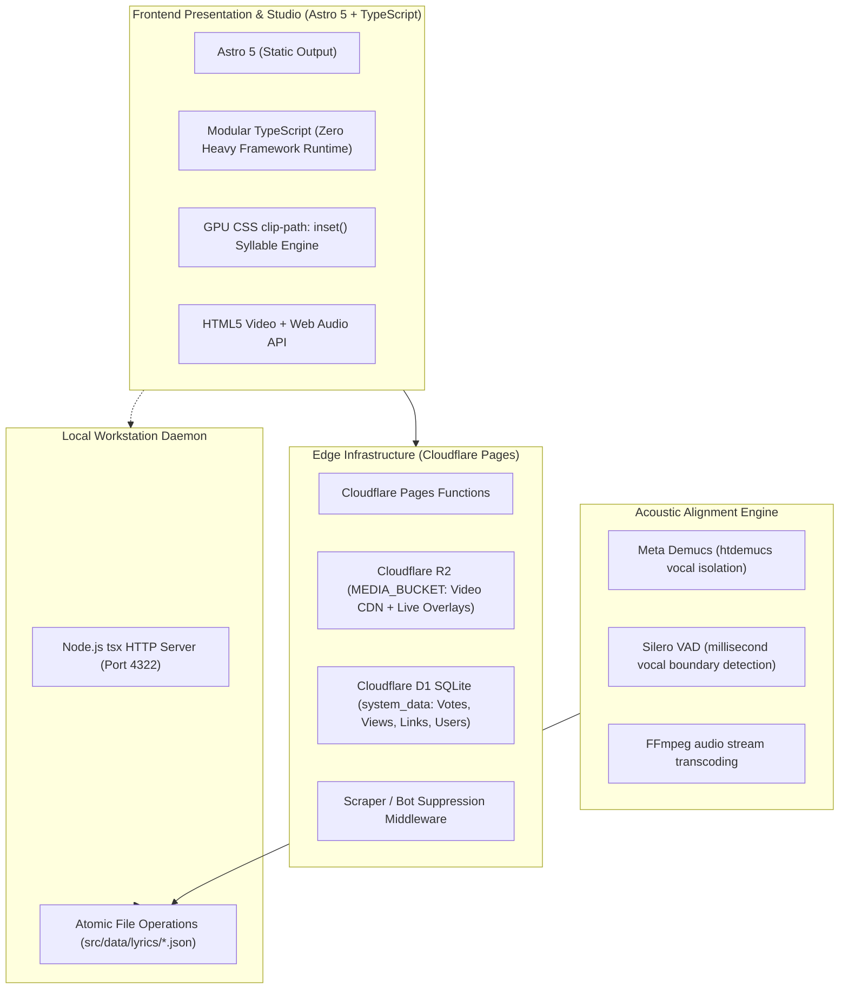

# Karaoke Theater & Synchronization Suite

> A zero-latency, 60 FPS web karaoke presentation engine, millisecond-accurate lyric synchronization workstation, and multi-tier persistence pipeline designed for high-fidelity multi-lingual performance.

---

## 🌟 Overview & Mission

**Karaoke Theater** is a specialized, high-performance web platform built to deliver an authentic, broadcast-grade karaoke experience directly in modern web browsers. Tailored for intricate multilingual typography—including complex Japanese Kanji with Yomitan ruby (furigana) annotations, Cyrillic, and Latin scripts—the platform bridges the gap between desktop rhythm games, professional subtitle workstations, and cloud media streaming.

The system combines four tightly integrated environments:
1. **Theater Presentation Runtime**: A distraction-free, 60 FPS dual-line alternating lyrics presentation engine featuring continuous GPU-accelerated syllable wiping, ambient dynamic backlight projection, phonetic search, and passive fingerprint-based voting.
2. **Synchronization Studio**: A keyboard-first web workstation enabling real-time, millisecond-accurate tap-to-sync timestamping, waveform scrubbing, live active verse HUD previews, and non-destructive timing manipulation.
3. **Multi-Tier Persistence Engine**: A fail-safe synchronization architecture spanning a local Node.js sync daemon, zero-delay Cloudflare R2 live overlay caching, direct GitHub repository commits via REST API, and offline JSON export fallbacks.
4. **AI Acoustic Alignment Pipeline**: A Python engine leveraging Meta Demucs (`htdemucs`) for neural vocal stem separation and Silero VAD for sub-centisecond speech boundary detection to calibrate phrase endings automatically.

---

## 📑 Architecture Documentation Sitemap

| Specification Document | Focus Area | Key Architectural Components Covered |
| :--- | :--- | :--- |
| **[01. Architecture Overview](./01-architecture-overview.md)** | System Topology & Design Philosophy | 4-tier pipeline, media separation architecture, zero-delay live overlay design, client-side protection, warm near-black & brass aesthetic. |
| **[02. Data Contracts & Schemas](./02-data-contracts-and-schemas.md)** | Data Modeling & Invariants | `Word`, `Verse`, `SongMetadata`, mathematical contract validation (`validateSongContract`), timing auto-healing (`autoHealTimings`), Cloudflare D1 SQL schema, branded type enforcement. |
| **[03. Tokenizer & NLP Pipeline](./03-tokenizer-and-nlp-pipeline.md)** | Text Processing & Typography | Ingestion of raw lyrics & LRC files, Japanese regex tokenizer (Ruby annotations `漢字[ふりがな]`, compound kana `拗音/促音/長音`, Kanji, alphanumeric), punctuation auto-attachment (`cleanVersePunctuation`), canonical slug generation. |
| **[04. Playback & Render Engine](./04-playback-and-render-engine.md)** | Real-Time 60 FPS Rendering | `requestAnimationFrame` render loop, strict 4.0s vocal lead-in rule, alternating dual-line staging (even/odd lines), GPU continuous syllable wipe via `clip-path: inset()`, furigana synchronized wiping, ambient dynamic backlight, theater controls. |
| **[05. Synchronization Studio Workstation](./05-synchronization-studio-workstation.md)** | Studio Workstation & Tap-to-Sync | 3-column workstation grid, keyboard tap-to-sync state machine (Spacebar timestamping, Backspace undo, Tab navigation, `[` / `]` nudge by 50ms), active HUD, timeline verse blocks, direct R2 video upload modal, zero-data-loss export. |
| **[06. Sync Server & Multi-Tier Persistence](./06-sync-server-and-multi-tier-persistence.md)** | Persistence & AI Audio Pipeline | Local sync daemon (`scripts/sync-server.ts`), Cloudflare Pages serverless save handler, GitHub API commits, Demucs neural vocal isolation + Silero VAD acoustic alignment (`scripts/align-vocals.py`), share link generator. |
| **[07. Cloud Infrastructure & Catalog](./07-cloud-infrastructure-and-catalog.md)** | Cloudflare Edge & Security | Cloudflare Pages, R2 Media Bucket (`https://cdn.sudothy.me`), D1 SQLite database (`system_data`), anti-scraper middleware, dynamic 6-character shortlinks (`[code].js`), passive browser fingerprinting (`kr-XXXX-XXXX`), 5.47s genuine view counter. |
| **[08. Standalone Engine Blueprint](./08-standalone-engine-blueprint.md)** | SDK Decoupling & Future Roadmap | Architecture blueprint for packaging the core engine as a headless `@nixlabs/karaoke-core` SDK, framework adapters (React, Vue, Svelte), custom persistence adapters, pitch detection & audio worklets roadmap. |

---

## 🚀 Quickstart & Developer Runbook

### Prerequisites
- **Node.js**: v20.x or higher
- **Package Manager**: `npm` or `pnpm`
- **Wrangler CLI**: v4.x (for Cloudflare D1/R2 development and deployment)
- **Python (Optional, for acoustic alignment)**: Python 3.10+ with `torch`, `torchaudio`, `demucs`, `silero-vad`, `soundfile`, and `ffmpeg`.

### 1. Installation
Clone the repository and install all dependencies:
```bash
git clone https://github.com/okaythi/karaoke.git
cd karaoke
npm install
```

### 2. Development Servers

#### Running the Karaoke Theater (Frontend)
Launches the Astro development server at `http://localhost:4321`:
```bash
npm run dev
```

#### Running the Local Sync Daemon (Studio Workstation Backend)
Launches the local atomic persistence daemon at `http://localhost:4322`. When active, saving from the Studio workstation writes directly to local Git files (`src/data/lyrics/<id>.json` and `src/data/songs-manifest.json`):
```bash
npm run sync:server
```

#### Generating & Syncing Shortlinks to Cloudflare D1
Assigns deterministic 6-character alphanumeric share codes to any unassigned tracks and synchronizes them with the remote Cloudflare D1 database:
```bash
npm run sync:links
```

### 3. Production Build & Validation
To perform TypeScript type checking and create a production build:
```bash
# Type check Astro components and TypeScript files
npm run check

# Compile static assets to dist/
npm run build

# Preview production build locally
npm run preview
```

### 4. Cloudflare Deployment
Deploy the static build and Cloudflare Pages Functions to production:
```bash
npx wrangler pages deploy dist --project-name karaoke
```

---

## 🛠️ Technology Stack



- **Framework**: [Astro 5](https://astro.build/) in static output mode.
- **Languages**: TypeScript 5.7 (strict typing, compile-time branded types), JavaScript (ES Modules), Python 3.10+.
- **Edge Cloud**: Cloudflare Pages Functions, Cloudflare R2 Object Storage, Cloudflare D1 Serverless SQLite.
- **Audio & ML**: PyTorch, Meta Demucs, Silero VAD, FFmpeg.
- **Design System**: Custom CSS variables, warm near-black aesthetic (`#131211`), brass accent palette (`#deb668`), JetBrains Mono, Plus Jakarta Sans, Zen Kurenaido, and Noto Sans JP.

---

## 📂 Codebase Directory Structure

```
karaoke/
├── astro.config.mjs               # Astro 5 configuration (static output)
├── wrangler.toml                  # Cloudflare Pages, R2 & D1 binding configuration
├── package.json                   # Scripts, dependencies, and toolchain
├── tsconfig.json                  # TypeScript compiler options
├── docs/                          # Comprehensive architectural specifications
│   ├── README.md                  # Documentation hub & project quickstart
│   ├── 01-architecture-overview.md
│   ├── 02-data-contracts-and-schemas.md
│   ├── 03-tokenizer-and-nlp-pipeline.md
│   ├── 04-playback-and-render-engine.md
│   ├── 05-synchronization-studio-workstation.md
│   ├── 06-sync-server-and-multi-tier-persistence.md
│   ├── 07-cloud-infrastructure-and-catalog.md
│   └── 08-standalone-engine-blueprint.md
├── functions/                     # Cloudflare Pages Functions (Edge API)
│   ├── _middleware.js             # Anti-crawler and link preview suppression middleware
│   ├── [code].js                  # Dynamic 6-character shortlink redirect router
│   └── api/
│       ├── fingerprint.ts         # Device fingerprinting & kr-ID resolution
│       ├── vote.js                # Like/dislike voting & 5.47s genuine view counter
│       ├── admin/karaoke/
│       │   ├── save.js            # Multi-tier remote save (R2 live overlay + GitHub commit)
│       │   └── upload.js          # Direct multipart video upload to R2
│       └── karaoke/
│           ├── lyrics.js          # R2 live overlay reader (_lyrics_live/<id>.json)
│           └── videos.js          # R2 bucket video and live lyric scanner
├── scripts/                       # Developer & maintenance tooling
│   ├── sync-server.ts             # Local atomic persistence HTTP daemon (port 4322)
│   ├── generate-share-links.ts    # Shortlink generator & D1 database synchronizer
│   ├── align-vocals.py            # Demucs + Silero VAD automated vocal alignment engine
│   └── realign_ic3peak_accurate.py # Whisper/VAD precision calibration script
└── src/
    ├── catalog/                   # Catalog discovery, sorting & iTunes art resolution
    │   ├── catalog.ts             # Catalog union (Manifest + R2 + Live Overlays)
    │   ├── itunes.ts              # iTunes Search API scoring and storefront fallbacks
    │   └── sorter.ts              # Phonetic Japanese Romaji sorting engine
    ├── core/                      # Shared business logic & validation rules
    │   ├── contracts.ts           # Contract validation & auto-healing timing heuristics
    │   ├── punctuation.ts         # Punctuation merging & attachment engine
    │   └── tokenizer.ts           # Japanese NLP tokenizer, LRC parser, and slugifier
    ├── data/                      # Committed static data files
    │   ├── songs-manifest.json    # Master registry of catalog metadata
    │   └── lyrics/                # Individual lyric JSON files (*.json)
    ├── fingerprint/               # Passive device fingerprinting
    │   ├── fingerprint.ts         # 12 parallel browser entropy signal collectors
    │   └── kr-id.ts               # Branded types and deterministic kr-XXXX-XXXX generator
    ├── pages/                     # Astro entrypoint routes
    │   ├── index.astro            # Karaoke Theater presentation page
    │   └── admin/
    │       └── karaoke.astro      # Synchronization Studio Workstation
    ├── player/                    # Theater frontend orchestration
    │   ├── fuzzySearch.ts         # Phonetic fuzzy search & ranking engine
    │   └── karaokePlayer.ts       # Main theater player controller & event bindings
    ├── renderer/                  # 60 FPS presentation engine
    │   ├── backlight.ts           # Ambient dynamic canvas backlight sampler
    │   └── renderEngine.ts        # 60 FPS dual-line alternating wipe engine
    ├── studio/                    # Studio synchronization workstation implementation
    │   ├── dom.ts                 # Strongly-typed DOM element bindings
    │   ├── format.ts              # Timecode formatting utilities (mm:ss.xxx)
    │   ├── index.ts               # Studio bootstrapping & event dispatching
    │   ├── modals.ts              # Upload, Ingestion, Shortcuts & Export modal controllers
    │   ├── persistence.ts         # Multi-tier client persistence orchestrator
    │   ├── player.ts              # Studio video monitor, playhead scrubber & live HUD
    │   ├── renderer.ts            # Matrix verse card & word chip DOM renderer
    │   ├── state.ts               # Centralized mutable state container
    │   ├── syncEngine.ts          # Tap-to-sync keyboard state machine
    │   └── types.ts               # Studio-specific TypeScript interfaces
    ├── styles/                    # Application styling
    │   ├── global.css             # Base resets, variables, and typography
    │   ├── theater.css            # Theater UI and continuous wipe CSS rules
    │   └── karaoke-studio.css     # Studio workstation layout and timing matrix styles
    └── types/
        └── karaoke.ts             # Canonical data models & payload interfaces
```
